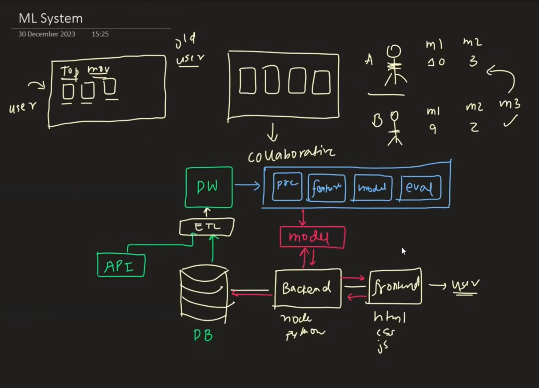

<br>  
<br>  

# `# Lecture: 01: Why MLOPS`

<br>  
<br>  

- 01: Software System vs ML System (Startup Example).
- 02: Startup Architecture.
- 03: Is The Architecture is Software System or ML System?
- 04: Properties of the System
- 05: If We Add ML System
- 06: Complixity With ML System

<br>
<br>

<br>

# `#01 Software and ML System(Startup-Example):`

<br>


১০০টি মেশিন লার্নিং মডেল তৈরি করা হলে, মাত্র ৩০টি প্রকৃত প্রোডাক্টে রূপান্তরিত হয়? অর্থাৎ, মেশিন লার্নিং সফটওয়্যার দুটি অংশে তৈরি করা হয়—প্রথমে আপনি একটি মডেল বানান, তারপর তার চারপাশে সফটওয়্যার বানান। আজকের ইন্ডাস্ট্রিতে, এটি একটি ভয়ঙ্কর পরিসংখ্যান যে মাত্র ৩০% মডেল প্রোডাকশনে ডেপ্লয় করা হয়। 

এটা বোঝা জরুরি, কারণ ML Ops শেখার আগে আপনাকে জানতে হবে কেন ML Ops শিখবেন। মেশিন লার্নিং সিস্টেমে এমন কী হয় যে তাদের সাফল্যের হার এত কম? এই আলোচনাকে সহজ করতে, আমি এই পুরো বিষয়টিকে সফটওয়্যার সিস্টেমের সাথে তুলনা করব। এই তুলনা করার দুটি কারণ আছে—  

১. মেশিন লার্নিং সিস্টেম এবং সফটওয়্যার সিস্টেমের মধ্যে অনেক মিল আছে। তারা যমজ ভাই নয়, তবে Cousins বলা চলে।  
২. সফটওয়্যার সিস্টেম এখন খুব পরিপক্ব—এটি ৭০-এর দশকে শুরু হয়ে ২০২০ সাল পর্যন্ত ৫০ বছরেরও বেশি সময় ধরে বিকশিত হয়েছে।  

আমরা সফটওয়্যার সিস্টেম এবং মেশিন লার্নিং সিস্টেমকে পাশাপাশি তুলনা করে বুঝব—কেন মেশিন লার্নিং সিস্টেমের ইঞ্জিনিয়ারিং দিকটি সফটওয়্যার সিস্টেমের তুলনায় বেশি কঠিন। সফটওয়্যার সিস্টেম এবং মেশিন লার্নিং সিস্টেমের পার্থক্য বোঝার জন্য আমরা একটি উদাহরণ নেব। ধরুন, আমরা একটি স্টার্টআপে কাজ করি—এটি মূলত একটি ওয়েবসাইট, একটি মুভি স্ট্রিমিং প্ল্যাটফর্ম। তাদের বিশেষত্ব হলো—তাদের প্ল্যাটফর্মে পুরনো মুভি পাওয়া যাবে, যেকোনো ভাষায়, যত পুরনোই হোক না কেন!  

এই স্টার্টআপের নাম দিলাম **"Retro Movies"**। তারা ফান্ডিং পেয়েছে এবং প্রথমেই ১০,০০০ পুরনো মুভির স্ট্রিমিং রাইটস কিনেছে। এখন, তাদের হোমপেজে কী দেখাবে? প্রোডাক্ট ম্যানেজাররা সিদ্ধান্ত নিলেন—**"New Arrivals"** দেখাবেন, অর্থাৎ নতুন যেসব মুভি ক্যাটালগে যোগ হচ্ছে। কিন্তু, কিছুদিন পর বোঝা গেল—এসব মুভি সবাই পছন্দ করছে না, ইউজার এনগেজমেন্ট কম। তাই নতুন সিদ্ধান্ত হলো—**"Top Movies"** দেখানো হবে, অর্থাৎ প্ল্যাটফর্মের সেরা ৫০ বা ১০০ মুভি হোমপেজে ডিসপ্লে করা হবে। এতে ইউজাররা ভালো মুভি দেখবে এবং প্ল্যাটফর্মে বেশি সময় কাটাবে।  

**প্রশ্ন হলো:** **"Top Movies"** কিভাবে বাছাই করবে?  
একটি সহজ সমাধান হলো—প্রতিটি মুভির পেজে **রেটিং সিস্টেম** দেওয়া। ইউজাররা ১ থেকে ১০ স্কেলে রেটিং দেবে, এবং গড় রেটিং অনুযায়ী মুভিগুলো সাজানো হবে।  

**সমস্যা কোথায়?**  
ধরুন, **ভাইয়ের (সালমান খান)** একটি মুভি আপলোড করা হলো। ভাইয়ের ফ্যান্স প্রচুর, তারা সবাই ১০ রেটিং দেবে! ফলে সেই মুভি গড়ে ১০ পেয়ে সবার ওপরে চলে আসবে। কিন্তু আমরা জানি, ভাইয়ের মুভি সবসময় সেরা নয়!  

**সমাধান কী?**  
এক্ষেত্রে **Weighted Rating** ব্যবহার করা যেতে পারে। যেমন, **IMDB-এর সূত্র**:  

```text
Weighted Rating (WR) = (v / (v + m)) * R + (m / (v + m)) * C
```

**যেখানে:**  
- **v** = মুভিটির ভোটের সংখ্যা (যতজন রেটিং দিয়েছে)।  
- **m** = ন্যূনতম ভোটের theshold value (যেমন: ২৫,০০০ ভোট)।  
- **R** = মুভিটির গড় রেটিং।  
- **C** = সব মুভির গড় রেটিং (যেমন: ৬.৫)।  

**এই সূত্র কী করে?**  
- যদি কোনো মুভিতে **ভোট কম** থাকে (যেমন: নতুন সালমান খানের মুভি), তবে এটি **সামগ্রিক ডাটাবেসের গড় (C)** এর কাছাকাছি রেটিং পাবে।  
- যদি **ভোট বেশি** থাকে (যেমন: ক্লাসিক মুভি), তবে তার **আসল রেটিং (R)** বেশি প্রভাব ফেলবে।  

এভাবে **"ভাইয়ের মুভি"** হঠাৎ করে টপ লিস্টে চলে আসবে না, যদি তাতে পর্যাপ্ত ভোট না থাকে!  

<br>

# `#02 **Architecture:**`

<br>

এই সিস্টেম বানাতে কী লাগবে?  
১. **Database:**  
   - এখানে আপনার ১০,০০০ মুভির সমস্ত মেটাডাটা স্টোর করা থাকবে।  
   - টেবিলের কলামগুলোর মধ্যে থাকবে:  
     - Genre  
     - Actor
     - Movie id 
     - Release Year  
     - Average Rating
     - Weighted Rating 

২. **Backend:**  
   - ডাটাবেসের সাথে কানেক্টেড থাকবে।  
   - ফ্রন্টএন্ড থেকে রিকোয়েস্ট পেলে, এটি ডাটাবেস থেকে ডাটা fetch করে প্রসেস করবে।  

৩. **Frontend (Website):**  
   - ইউজার যখন ওয়েবসাইট লোড করবে, ফ্রন্টএন্ড ব্যাকএন্ডকে বলবে: *"আমাকে টপ ৫০ মুভি দেখাও"*।  
   - ব্যাকএন্ড **recommendation model** (এক্ষেত্রে Weighted Rating ফর্মুলা) ব্যবহার করে ডাটাবেস থেকে টপ মুভিগুলো বের করে আনবে।  

৪. **Recommendation model:**  
   - এটি ডাটাবেসের সব মুভির Weighted Rating ক্যালকুলেট করে।  
   - সেগুলোকে **ডিসেন্ডিং অর্ডারে সাজিয়ে** টপ ৫০ মুভি বাছাই করে।  
   - এই ডাটা ফ্রন্টএন্ডে পাঠানো হয়, যা ইউজারকে দেখায়।  


<br>

# `#03 **IS This System is Software or ML System?:**`

<br>

এই সিস্টেমে **কোনো মেশিন লার্নিং নেই**, কারণ:  
- এখানে শুধু একটি **নির্দিষ্ট ফর্মুলা (Weighted Rating)** ব্যবহার করে রেটিং ক্যালকুলেট করা হচ্ছে।  
- কোনো ডাটা থেকে **লার্নিং** বা **প্যাটার্ন শেখা** happening না।  

<br>

# `#04 **Properties of the System:**`

<br>

#### **1. Complexity:**  
- সিস্টেমটি **সরল** এবং **দুইটি মেইন কম্পোনেন্ট** নিয়ে গঠিত:  
  - ডাটাবেস (Robust)  
  - কোড (backend + frontend)  
- কোড ভালোভাবে ম্যানেজ করলে সিস্টেমটি সহজেই চলে।  

#### **2. Error Debugging:**  
- যদি ওয়েবসাইট কাজ না করে, error **Code block** হবে।  
- ডিবাগ করা সহজ, কারণ সমস্যার উৎস স্পষ্ট।  

#### **3. New data hadling:**  
- যদি **৫০টি নতুন মুভি** যোগ করা হয়, সিস্টেম স্বয়ংক্রিয়ভাবে সেগুলোকে Weighted Rating অনুযায়ী সাজিয়ে নেবে।  
- ইউজার পরের বার ওয়েবসাইট লোড করলেই আপডেটেড লিস্ট পাবে।  

#### **4. Determinstic System:**  
- একই ইনপুট → একই আউটপুট।  
  - আজকে ৩০ ডিসেম্বর যে রেটিং দেখাচ্ছে, **১ বছর পরেও** একই ডাটা দিলে একই ফলাফল দেবে।  
- **গভর্নেন্স সহজ:**  
  - কেউ জিজ্ঞাসা করলে বলতে পারবেন, *"আমরা IMDB-এর সূত্র ব্যবহার করি, তাই এই মুভি টপে আছে!"*  

#### **5. Zero Drift:**  
- সিস্টেমটি **কখনো হঠাৎ ফেইল করবে না**।  
- একবার লজিক সেট করলে, এটি **চিরকাল** ঠিকভাবে কাজ করবে।  

<br>

# `#05 **If We Take ML System**`  

<br>




<br>


**Situation:** আমাদের মুভি স্ট্রিমিং ওয়েবসাইট (Retro Movies) এখন প্রায় দেড় বছর পুরনো। প্রোডাক্ট ম্যানেজমেন্ট টিম লক্ষ্য করেছে—**ইউজার এনগেজমেন্ট কমে যাচ্ছে**। কারণ:  

- **পুরনো ইউজাররা** ইতিমধ্যে টপ মুভিগুলো দেখে ফেলেছে।  
- তারা ওয়েবসাইটে এসে **নতুন কিছু পাচ্ছে না**, তাই চলে যাচ্ছে।  

### **Solution:** **Personalized Recommendation System:** বানানো।  

### **How will the personalized Recommendation system will work?**  
**ML-ভিত্তিক Collaborative Filtering:**  
১. **ইউজার প্রোফাইল তৈরি:**  
   - প্রতিটি ইউজারের মুভি রেটিং, লাইক/ডিসলাইক, scrolling behaviour track করা হবে।  
   - উদাহরণ:  
     - ইউজার A → মুভি ১-এ ১০ রেটিং দিয়েছে, মুভি ২-এ ০।  
     - ইউজার B → মুভি ১-এ ০ রেটিং, মুভি ২-এ ১০।  
   - যদি **ইউজার A এবং B-এর টেস্ট মিলে যায়**, তবে ইউজার B-এর দেখা নতুন মুভি A-কে রিকমেন্ড করা হবে।  

২. **More data collection from user:**  
   - আগের সিস্টেমে শুধু **রেটিং** সংগ্রহ করা হতো। এখন অতিরিক্ত ডাটা নেওয়া হবে:  
     - কোন মুভি কতক্ষণ দেখলো  
     - শেয়ার বা বুকমার্ক করলো কিনা  
     - scrolling behaviour 

<br>

## `**Architecture with ML System: **` 

<br>

### **১. Database:**  
   - মুভি মেটাডাটা (আইডি, জেনার, অ্যাক্টর ইত্যাদি)।  
   - ইউজার ডাটা (লগিন, রেটিং, এক্টিভিটি)।  

### **2. Backend + Frontend:**  
   - ফ্রন্টএন্ড থেকে **user behaviour data (more data collection from user)** সংগ্রহ করে ব্যাকএন্ডে পাঠানো হবে।  
   - ব্যাকএন্ড এই ডাটা **ডাটাবেসে সেভ** করবে।  

### **3. New Componant: Data Warehouse:**  
   - **প্রয়োজনীয়তা:**  
     - প্রাইমারি ডাটাবেসে ওয়েবসাইটের রিয়েল-টাইম লোড থাকে, তাই এতে **মডেল ট্রেনিং চালানো ঝুঁকিপূর্ণ**।  
     - সমাধান: **ETL পাইপলাইন** তৈরি করে ডাটা ওয়্যারহাউসে নেওয়া।  
       - **Extract:** ডাটাবেস/API (যেমন IMDB) থেকে ডাটা নেওয়া।  
       - **Transform:** ডাটা ক্লিনিং, ফিচার ইঞ্জিনিয়ারিং।  
       - **Load:** ওয়্যারহাউসে স্টোর করা।  

### **4. Work of data science team:**  
   - **Preprocessing:** নোইজি ডাটা ফিল্টার করা।  
   - **Feature Extraction:** ইউজার-মুভি ইন্টারেকশন প্যাটার্ন বের করা।  
   - **Model Building:** Collaborative Filtering অ্যালগরিদম (যেমন Matrix Factorization)।  
   - **Evaluation:** মডেলের অ্যাকুরেসি টেস্ট করা।  

### **৫. মডেল সার্ভিং:**  
   - ট্রেন্ড মডেলটি **ব্যাকএন্ডের সাথে ইন্টিগ্রেট** করা হবে।  
   - ইউজার লগ ইন করলে, ব্যাকএন্ড মডেলকে জিজ্ঞাসা করবে: *"এই ইউজারের জন্য টপ ৫ রিকমেন্ডেশন কী?"*  
   - মডেল উত্তর দেবে → ফ্রন্টএন্ডে শো করা হবে।  


### **পুরনো vs. নতুন সিস্টেমের তুলনা:**  
| **অ্যাসপেক্ট**          | **সফটওয়্যার সিস্টেম (Weighted Rating)** | **ML সিস্টেম (Collaborative Filtering)** |  
|-------------------------|------------------------------------------|------------------------------------------|  
| **Complexity**        | সহজ (২-৩ কম্পোনেন্ট)                   | জটিল (ETL, ওয়্যারহাউস, মডেল ট্রেনিং) |  
| **Error Debugging**         | সহজ (কোড-স্পেসিফিক)                   | কঠিন (ব্ল্যাক বক্স মডেল)              |  
| **New data handaling**| অটোমেটিক (ফর্মুলা বেসড)              | রি-ট্রেনিং প্রয়োজন                   |  
| **Deterministic**      | হ্যাঁ (একই ইনপুট → একই আউটপুট)       | না (মডেল ভিন্ন ফল দিতে পারে)          |  
| **Drift**              | zero drift                           | ডাটা ড্রিফট হতে পারে (ইউজার টেস্ট চেঞ্জ) |  


<br>

# `#06 **Complexity with ML System: **` 

<br>

আগের সফটওয়্যার সিস্টেমে শুধু **Weighted Rating ফর্মুলা** ব্যবহার করে মুভি রিকমেন্ড করা হতো। কিন্তু **ML-ভিত্তিক Collaborative Filtering** যোগ করায় সিস্টেমের জটিলতা বেড়েছে। নিচে মূল পরিবর্তনগুলো ব্যাখ্যা করা হলো:  


### **1.Increased Complexity: **  
- **Old System:** শুধু **ডেভেলপার টিম** (ব্যাকএন্ড + ফ্রন্টএন্ড) কাজ করত।  
- **New System:** এখন **৩টি টিম** একসাথে কাজ করে:  
  - **Developer Team:** ওয়েবসাইটের কোড ম্যানেজ করে।  
  - **Data Engineering Team:** ডাটা ওয়্যারহাউস, ETL পাইপলাইন তৈরি করে।  
  - **Data Science Team:** মডেল ট্রেনিং, ইভ্যালুয়েশন করে।  

- **Extra Component:** ডাটা ওয়্যারহাউস, মডেল সার্ভিং, ফিচার স্টোর—এগুলো ম্যানেজ করা কঠিন।  

### **2. Harder To Debugging Error: **  
- **সমস্যা কোথায় হতে পারে?**  
  - কোডে বাগ (ব্যাকএন্ড/ফ্রন্টএন্ড)।  
  - ডাটা কালেকশনে ভুল (যেমন: ইউজার বিহেভিয়র ট্র্যাক না করা)।  
  - মডেলের ভুল প্রেডিকশন (অপ্টিমাইজেশন প্রয়োজন)।  
- **ML সিস্টেমে** সমস্যার উৎস খুঁজে বের করা **ব্ল্যাক বক্স**-এর মতো—এটি সহজ নয়!  


### **3. New Data Handling Issues: **  
- **পুরনো সিস্টেম:** নতুন মুভি যোগ করলে **অটোমেটিকালি** Weighted Rating ক্যালকুলেট হয়ে যেত।  
- **ML সিস্টেমে:**  
  - নতুন ডাটা ওয়্যারহাউসে লোড করতে হবে।  
  - **মডেল রি-ট্রেনিং** প্রয়োজন (প্রি-প্রসেসিং, ফিচার ইঞ্জিনিয়ারিং, ইভ্যালুয়েশন)।  
  - রিসোর্স ও টাইম বেশি লাগে।  

### **4. Probabilistic Model:**  
- **পুরনো সিস্টেম:** একই ইনপুট → একই আউটপুট (IMDB ফর্মুলা)।  
- **ML সিস্টেম:**  
  - একই ইনপুট দিলেও **ভিন্ন আউটপুট** আসতে পারে (মডেলের প্যারামিটার বা ডাটা চেঞ্জ হলে)।  
  - **গভর্নেন্স ইস্যু:**  
    - উদাহরণ: যদি সিস্টেম একটি **Adult rated movie** শিশুকে রিকমেন্ড করে, তাহলে ব্যাখ্যা করা কঠিন হবে "কেন এমন হলো?"  

### **৫. Privacy Concerns**  
- ML মডেল ট্রেনিংয়ের জন্য **ইউজার বিহেভিয়র ডাটা** (ক্লিক, স্ক্রলিং, শেয়ার) সংগ্রহ করতে হয়।  
- **Privacy Law's**: বড় কোম্পানিগুলোকে ডাটা কালেকশন নিয়ে সতর্ক থাকতে হয়, নয়তো মামলা হতে পারে!  

### **6. Drift Issues:**  
ML সিস্টেমে **৩ ধরনের ড্রিফট** হতে পারে:  
1. **Data Drift:** ইউজারের টেস্ট চেঞ্জ হলে (যেমন: ব্রেকআপের পর রোমান্টিক মুভি না দেখে Action ভিডিও দেখা)।  
2. **Concept Drift:** বাহ্যিক ঘটনা (যেমন: Virat Kohli একটি মুভির প্রশংসা করলে সেটির রেটিং বেড়ে যাওয়া)।  
3. **Model Drift:** নতুন মার্কেটে এক্সপ্যানশন (যেমন: Bangladesh থেকে দক্ষিণ কোরিয়ায় সার্ভিস চালু হলে ডেমোগ্রাফিক চেঞ্জ: The behaviour of Bangladeshi people and Korean People will not be the same.)।  

**Solution:** নিয়মিত **মডেল মনিটরিং + রি-ট্রেনিং** প্রয়োজন।  


## **7. মাল্টিপল মডেলের জটিলতা (Complexity with Multiple Models)**  
ধরুন, আমরা **৩টি মডেল** যোগ করলাম:  
1. **মডেল ১:** মুভি রিকমেন্ডেশন (Collaborative Filtering)।  
2. **মডেল ২:** এড রিকমেন্ডেশন (মুভির জেনার অনুযায়ী প্রোডাক্ট শো করা)।  
3. **মডেল ৩:** **চার্ন প্রেডিকশন** (ইউজার প্ল্যাটফর্ম ছাড়বে কিনা)।  

এখন, **মডেল ২ ও ৩**, মডেল ১-এর আউটপুটের উপর নির্ভরশীল → **ডিপেন্ডেন্সি বেড়ে গেছে!**  
- **স্কেলিং সমস্যা:** ১০ কোটি ইউজারের জন্য এই সিস্টেম ম্যানেজ করা **অত্যন্ত কঠিন**।  

## **MLOps-এর প্রয়োজনীয়তা**  
এই সমস্ত চ্যালেঞ্জ মোকাবেলার জন্যই **MLOps** (Machine Learning Operations) এর প্রয়োজন:  
- **অটোমেশন:** ডাটা পাইপলাইন, মডেল ট্রেনিং, ডেপ্লয়মেন্ট।  
- **মনিটরিং:** ড্রিফট ডিটেকশন, পারফরম্যান্স ট্র্যাকিং।  
- **গভর্নেন্স:** মডেলের ডিসিশন এক্সপ্লেইন করা (Explainable AI)।  


