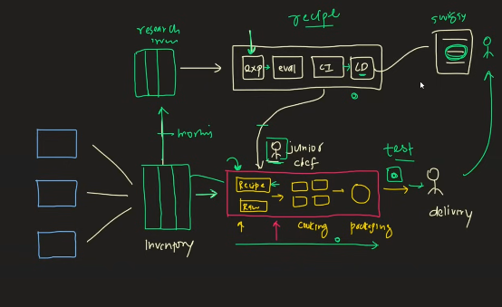
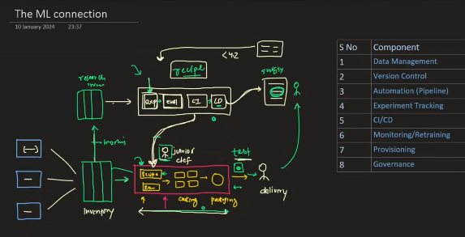

 
 

# `# What is MLOPS?`

 

- 01: Understand with Story
- 02: ML Connection with the story

 

# `#01 Understand With Story:`

 

 

#### ১. ভূমিকা: MLOps কী?
MLOps (মেশিন লার্নিং সিস্টেম অপারেশন) হলো এমন একটি প্রক্রিয়া যেখানে ডেটা সায়েন্টিস্ট, মেশিন লার্নিং ইঞ্জিনিয়ার এবং আইটি প্রফেশনালরা একসঙ্গে কাজ করে একটি মেশিন লার্নিং অ্যাপ্লিকেশনের পুরো জীবনচক্রকে স্বয়ংক্রিয় ও উন্নত করে। এই সংজ্ঞা জটিল মনে হতে পারে, তাই আমরা ইয়াসিন আরাফাতের একটি সহজ গল্পের মাধ্যমে এটি বুঝব। গল্পটি শুনে এই সংজ্ঞা স্পষ্ট হয়ে যাবে।

---

#### ২. গল্পের শুরু: নুডলস ব্যবসার আইডিয়া
- **পটভূমি**: ইয়াসিন আরাফাত নামে একজন ইঞ্জিনিয়ারিং ছাত্র তার বাবা-মায়ের বিবাহবার্ষিকী উপলক্ষে একটি পার্টি আয়োজন করে। সে খুব ভালো নুডলস রান্না করতে পারে।
- **পার্টির সাফল্য**: পার্টিতে সবাই তার নুডলসের প্রশংসা করে। একজন কাকা বলেন, “তুই দোকান খোল, নুডলস বিক্রি করে অনেক টাকা কামাতে পারবি।”
- **ব্যবসার আইডিয়া**: ইয়াসিনের মনে হয়, সত্যিই কি সে একটি নুডলসের দোকান খুলতে পারে? সে তার বাবা-মায়ের সঙ্গে কথা বলে এবং একটি ছোট ক্লাউড কিচেন খোলার সিদ্ধান্ত নেয়। সে Swiggy-তে একটি অ্যাকাউন্ট খোলে এবং ব্যবসা শুরু করে।
- **প্রাথমিক প্রক্রিয়া**:
  - গ্রাহক Swiggy-তে নুডলসের অর্ডার দেন।
  - ইয়াসিন নুডলস রান্না করে এবং ডেলিভারি বয়ের হাতে দেন।
  - প্রয়োজনীয় সার্টিফিকেশন (যেমন FSSAI) এবং রান্নার সরঞ্জাম সে সংগ্রহ করে।

---

#### ৩. প্রথম সমস্যা: ইনভেন্টরি ম্যানেজমেন্ট
- **প্রাথমিক চ্যালেঞ্জ**: প্রথম কয়েকদিন ১-২টি অর্ডার আসত। কিন্তু নুডলসের গুণগত মানের কারণে অর্ডার বাড়তে থাকে এবং দিনে ৫-১০টি অর্ডার আসতে শুরু করে।
- **সমস্যা**: প্রতিবার অর্ডার পাওয়ার পর ইয়াসিন পাশের দোকান থেকে সবজি, নুডলস এবং মশলা কিনে রান্না করত। ১০টি অর্ডারের জন্য দিনে ১০ বার এই কাজ করা কঠিন হয়ে পড়ে।
- **সমাধান: ইনভেন্টরি সিস্টেম**:
  - ইয়াসিন একটি ইনভেন্টরি তৈরি করে, যেখানে সে সবজি, নুডলস এবং মশলার জন্য আলাদা শেলফ রাখে।
  - সে Big Basket থেকে প্রতিদিন ১০টি অর্ডারের জন্য সবজি, অন্য দোকান থেকে নুডলস এবং SpiceSafar থেকে মাসে একবার মশলা অর্ডার করে।
  - প্রতিদিন সকালে এই উপকরণগুলো তার দোকানে আসে, সে সেগুলো শেলফে সাজিয়ে রাখে এবং প্রয়োজন অনুযায়ী ব্যবহার করে।
- **ফলাফল**: এই সিস্টেমের মাধ্যমে সে সহজেই দিনে ১০টি অর্ডার পূরণ করতে পারে এবং বারবার দোকানে যাওয়ার প্রয়োজন হয় না।

**MLOps-এর সঙ্গে সম্পর্ক**: ইনভেন্টরি ম্যানেজমেন্ট হলো MLOps-এর ডেটা ম্যানেজমেন্টের মতো। মেশিন লার্নিং মডেলের জন্য ডেটা সংগ্রহ, সংরক্ষণ এবং সঠিকভাবে ব্যবহারের ব্যবস্থা করা হয়।

---

#### ৪. দ্বিতীয় সমস্যা: স্কেলিং এবং প্যারালাল প্রসেসিং
- **নতুন চ্যালেঞ্জ**: নুডলসের জনপ্রিয়তা বাড়ায় অর্ডার ১০ থেকে ২০, ৩০ এবং একদিন ৫০-এ পৌঁছে যায়। ইয়াসিন একা ৫০টি অর্ডার সামলাতে পারছিল না।
- **সমাধান: জুনিয়র শেফ এবং প্যারালাল প্রসেসিং**:
  - ইয়াসিন একজন জুনিয়র শেফ নিয়োগ করে। সে এবং জুনিয়র শেফ প্রত্যেকে ২৫টি অর্ডার সামলায়।
  - কিচেনে দুটি গ্যাস স্টোভ স্থাপন করা হয়, যাতে দুজনে একসঙ্গে রান্না করতে পারে।
  - নতুন প্রক্রিয়া:
    - উপকরণ ইনভেন্টরি থেকে দুটি স্টোভে যায়।
    - রান্নার পর খাবার প্যাকেজিং টেবিলে যায় এবং ডেলিভারির জন্য প্রস্তুত হয়।
- **ফলাফল**: এই প্যারালাল প্রসেসিংয়ের মাধ্যমে তারা দিনে ৫০টি অর্ডার সামলাতে সক্ষম হয়।

**MLOps-এর সঙ্গে সম্পর্ক**: প্যারালাল প্রসেসিং হলো MLOps-এর স্কেলিংয়ের মতো। মেশিন লার্নিং মডেলকে আরও বড় ডেটা বা বেশি কাজ সামলানোর জন্য একাধিক সার্ভার বা প্রসেসর ব্যবহার করা হয়।

---

#### ৫. তৃতীয় সমস্যা: কোয়ালিটি কন্ট্রোল এবং স্ট্যান্ডার্ডাইজেশন
- **নতুন সমস্যা**: Swiggy-তে কিছু গ্রাহকের রিভিউতে দেখা যায় যে নুডলসের স্বাদ কখনো ভালো, কখনো খারাপ হচ্ছে। এটি ঘটছে কারণ ইয়াসিন এবং জুনিয়র শেফের রান্নার মধ্যে পার্থক্য রয়েছে।
- **কারণ**: ইয়াসিন জুনিয়র শেফকে মৌখিকভাবে রান্নার নির্দেশ দিয়েছিল, যার ফলে সঠিক মান বজায় থাকেনি।
- **সমাধান: রেসিপি বুক**:
  - ইয়াসিন একটি রেসিপি বুক তৈরি করে, যেখানে সবকিছু বিস্তারিতভাবে লেখা থাকে (যেমন, কত গ্রাম সবজি, কতক্ষণ সেদ্ধ করতে হবে, কোন মশলা ব্যবহার করতে হবে)।
  - সে এবং জুনিয়র শেফ উভয়েই এই রেসিপি বুক অনুসরণ করে রান্না করে।
  - রেসিপি বুক আপডেট করা যায়। যদি জুনিয়র শেফ কোনো নতুন উপায় আবিষ্কার করে (যেমন, বেশি তাপমাত্রায় সেদ্ধ করলে নুডলস তাড়াতাড়ি তৈরি হয়), তবে সে রেসিপি বুকে পরিবর্তন যোগ করে। ইয়াসিনও নতুন উপকরণ (যেমন, ব্রকোলি) যোগ করতে পারে।
- **ফলাফল**: রেসিপি বুকের মাধ্যমে নুডলসের স্বাদ একই থাকে এবং সিস্টেমে একটি ভার্সন কন্ট্রোল তৈরি হয়।

**MLOps-এর সঙ্গে সম্পর্ক**: রেসিপি বুক হলো MLOps-এর মডেল ডকুমেন্টেশন এবং ভার্সন কন্ট্রোলের মতো। মেশিন লার্নিং মডেলের কোড, প্যারামিটার এবং আপডেটগুলো সঠিকভাবে সংরক্ষণ করা হয়।

---

#### ৬. চতুর্থ সমস্যা: অটোমেশন এবং স্কেলিং
- **নতুন চ্যালেঞ্জ**: অর্ডার ৫০ থেকে ৬০, ৭০ এবং একদিন ১০০-এ পৌঁছে যায়। ইয়াসিন এবং জুনিয়র শেফ দুজনে মিলেও ১০০টি অর্ডার সামলাতে পারছিল না।
- **ভুল সমাধান**: ইয়াসিনের বাবা পরামর্শ দেন আরেকজন শেফ নিয়োগ করতে। কিন্তু ইয়াসিন বুঝতে পারে যে প্রতি ৫০ অর্ডারের জন্য নতুন শেফ নিয়োগ করা সমাধান নয়, কারণ এতে কিচেনের জায়গা এবং খরচ বাড়বে।
- **সমাধান: অটোমেটেড কুকিং মেশিন**:
  - ইয়াসিন একটি অটোমেটেড কুকিং মেশিন কেনে, যা রেসিপি অনুযায়ী রান্না করে, প্যাকেজ করে এবং চারটি নুডলস একসঙ্গে তৈরি করতে পারে।
  - এই মেশিন দিনে ২০০-২৫০টি অর্ডার সামলাতে পারে।
  - নতুন প্রক্রিয়া:
    - উপকরণ ইনভেন্টরি থেকে মেশিনে যায়।
    - মেশিনে রেসিপি প্রোগ্রাম করা হয়।
    - মেশিন চারটি নুডলস রান্না করে, প্যাকেজ করে এবং ডেলিভারির জন্য প্রস্তুত করে।
    - জুনিয়র শেফ শুধু উপকরণ সরবরাহ করে এবং তৈরি নুডলস গ্রহণ করে।
- **ফলাফল**: এই অটোমেশনের মাধ্যমে ইয়াসিন ২০০টি অর্ডার সহজে সামলাতে পারে এবং স্বাদের মান একই থাকে।

**MLOps-এর সঙ্গে সম্পর্ক**: অটোমেটেড কুকিং মেশিন হলো MLOps-এর অটোমেটেড পাইপলাইনের মতো। মেশিন লার্নিং মডেলের ট্রেনিং, ডেপ্লয়মেন্ট এবং মনিটরিং স্বয়ংক্রিয়ভাবে করা হয়।

---

#### ৭. পঞ্চম সমস্যা: গ্রাহকের বিরক্তি এবং মেনু বৈচিত্র্য
- **নতুন সমস্যা**: দিনে ১৫০টি অর্ডার আসছিল, কিন্তু গ্রাহকরা শুধু ভেজ নুডলস খেয়ে বিরক্ত হয়ে যায়। তারা মাঞ্চুরিয়ান, চিকেন নুডলস, শেজওয়ান নুডলস ইত্যাদি চায়।
- **সমাধান: রিসার্চ ল্যাব**:
  - ইয়াসিন তার কিচেনে একটি রিসার্চ ল্যাব তৈরি করে, যেখানে নতুন রেসিপি পরীক্ষা করা হবে।
  - রিসার্চ ল্যাবের জন্য আলাদা ছোট ইনভেন্টরি তৈরি করা হয়, যেখানে প্রতিদিন সকালে প্রধান ইনভেন্টরি থেকে উপকরণ নেওয়া হয়।
  - ইয়াসিন চিকেন নুডলসের রেসিপি নিয়ে পরীক্ষা শুরু করে:
    - প্রথম পরীক্ষা: সাধারণ চিকেন নুডলস, কিন্তু কম ঝাল।
    - দ্বিতীয় পরীক্ষা: বেশি মশলা, কিন্তু সবজির পরিমাণ বাড়ানো দরকার।
    - তৃতীয় পরীক্ষা: বেশি সবজি এবং ঝাল, স্বাদ আরও ভালো।
    - মোট ১০টি পরীক্ষা করে সপ্তম পরীক্ষার চিকেন নুডলস সেরা হয়।
- **নতুন সমস্যা**: ইয়াসিন সপ্তম পরীক্ষার সঠিক রেসিপি লিখে রাখেনি, তাই সে সেই নুডলস পুনরায় তৈরি করতে পারেনি।
- **সমাধান: এক্সপেরিমেন্ট ট্র্যাকিং**:
  - ইয়াসিন একটি এক্সপেরিমেন্ট ট্র্যাকিং সিস্টেম চালু করে, যেখানে প্রতিটি পরীক্ষার বিস্তারিত লেখা হয় (যেমন, কত গ্রাম সবজি, কত মশলা, কতক্ষণ রান্না, ফলাফলের গুণমান)।
  - এই ট্র্যাকিংয়ের মাধ্যমে সে সেরা রেসিপি সহজে পুনরায় তৈরি করতে পারে।
- **ফলাফল**: রিসার্চ ল্যাব থেকে নতুন চিকেন নুডলসের রেসিপি তৈরি হয় এবং Swiggy-তে যোগ করা হয়।

**MLOps-এর সঙ্গে সম্পর্ক**: রিসার্চ ল্যাব হলো MLOps-এর মডেল ডেভেলপমেন্ট এবং এক্সপেরিমেন্ট ট্র্যাকিংয়ের মতো। নতুন মডেল তৈরি এবং তাদের পারফরম্যান্স ট্র্যাক করা হয়।

---

#### ৮. সম্পূর্ণ অটোমেশন: নতুন মেশিন
- **নতুন সমাধান**: ইয়াসিন আরেকটি মেশিন কেনে, যা চারটি ধাপে কাজ করে:
  1. **পরীক্ষা**: নতুন রেসিপি পরীক্ষা করা।
  2. **মূল্যায়ন**: পরীক্ষার ফলাফল বিভিন্ন প্যারামিটারে (যেমন, ঝাল, পুষ্টিগুণ, টেক্সচার) মূল্যায়ন করা।
  3. **ইন্টিগ্রেশন**: সেরা রেসিপি প্রধান কুকিং মেশিনে যোগ করা।
  4. **ডেপ্লয়মেন্ট**: নতুন মেনু আইটেম Swiggy-তে যোগ করা।
- **প্রক্রিয়া**:
  - রিসার্চ ইনভেন্টরি থেকে উপকরণ নতুন মেশিনে যায়।
  - পরীক্ষার ফলাফল মূল্যায়ন করা হয় এবং সেরা রেসিপি প্রধান মেশিনে যোগ করা হয়।
  - জুনিয়র শেফ নতুন রেসিপি পরীক্ষা করে এবং সঠিক হলে Swiggy-তে যোগ করে।
- **ফলাফল**: এই অটোমেশনের মাধ্যমে নতুন মেনু আইটেম যোগ করা সহজ হয় এবং গ্রাহকরা বিভিন্ন খাবার পেয়ে খুশি হয়। অর্ডার ২৫০-৩০০-এ পৌঁছে যায়।

**MLOps-এর সঙ্গে সম্পর্ক**: এই মেশিন হলো MLOps-এর CI/CD পাইপলাইনের মতো। মডেল ডেভেলপমেন্ট, টেস্টিং, ইন্টিগ্রেশন এবং ডেপ্লয়মেন্ট স্বয়ংক্রিয়ভাবে হয়।

---

#### ৯. চূড়ান্ত সমস্যা: পারফরম্যান্স মনিটরিং এবং রিট্রেনিং
- **নতুন সমস্যা**: পাঁচটি মেনু আইটেম যোগ করার পর গ্রাহকরা খুশি, কিন্তু কোনো আইটেমের রেটিং ৪.২-এর নিচে নেমে গেলে সমস্যা হতে পারে।
- **সমাধান: রিট্রেনিং সিস্টেম**:
  - ইয়াসিন একটি অ্যাডমিন ড্যাশবোর্ড তৈরি করে, যেখানে প্রতিটি মেনু আইটেমের রেটিং মনিটর করা হয়।
  - যদি কোনো আইটেমের রেটিং ৪.২-এর নিচে নামে, তবে সে রিসার্চ ল্যাবে নতুন পরীক্ষা করে। উদাহরণস্বরূপ, যদি কোনো সিজনাল সবজির স্বাদ খারাপ হয়, তবে তা বদলে অন্য সবজি ব্যবহার করা হয়।
  - নতুন রেসিপি পরীক্ষা, মূল্যায়ন এবং ইন্টিগ্রেশনের পর Swiggy-তে যোগ করা হয়।
- **ফলাফল**: এই রিট্রেনিং সিস্টেম নিশ্চিত করে যে কোনো মেনু আইটেমের পারফরম্যান্স কখনো খারাপ হয় না।

**MLOps-এর সঙ্গে সম্পর্ক**: রিট্রেনিং সিস্টেম হলো MLOps-এর মনিটরিং এবং রিট্রেনিং প্রক্রিয়ার মতো। মডেলের পারফরম্যান্স মনিটর করা হয় এবং প্রয়োজনে পুনরায় ট্রেনিং করা হয়।

---

#### ১১. গল্পের শেষ: MLOps-এর সংজ্ঞা স্পষ্ট করা
- **সাফল্য**: ইয়াসিন একটি সাধারণ কিচেন থেকে শুরু করে একটি প্রোডাকশন-গ্রেড কিচেন এবং রিসার্চ ল্যাব তৈরি করে, যা স্বয়ংক্রিয়ভাবে ২৫০টি অর্ডার সামলায়।
- **MLOps-এর সংজ্ঞা**:
  - ইয়াসিনের ইনভেন্টরি ম্যানেজমেন্ট = ডেটা ম্যানেজমেন্ট।
  - প্যারালাল প্রসেসিং = স্কেলিং।
  - রেসিপি বুক = মডেল ডকুমেন্টেশন এবং ভার্সন কন্ট্রোল।
  - অটোমেটেড মেশিন = অটোমেটেড পাইপলাইন।
  - রিসার্চ ল্যাব = মডেল ডেভেলপমেন্ট এবং এক্সপেরিমেন্ট ট্র্যাকিং।
  - রিট্রেনিং সিস্টেম = মনিটরিং এবং রিট্রেনিং।
- **শিক্ষা**: ভালো রান্না জানা যথেষ্ট নয়; একটি সফল ব্যবসার জন্য সঠিক প্রক্রিয়া, অটোমেশন এবং টিমওয়ার্ক দরকার। ঠিক তেমনি, MLOps মেশিন লার্নিং মডেলকে সফলভাবে ডেভেলপ, ডেপ্লয় এবং মেইনটেইন করতে সহায়তা করে।

 

# `#02: ML Connection with the story:`

 

#### ১. ভূমিকা: নুডলস ব্যবসার শিক্ষা
- **ইয়াসিনের শিক্ষা**: ইয়াসিন আরাফাত একটি সাধারণ নুডলস ব্যবসা শুরু করে শিখেছে যে একটি ছোট ব্যবসাও জটিল হতে পারে। এর মধ্যে রয়েছে:
  - টিমের সঙ্গে রান্না করা।
  - নতুন মেনু আইটেম যোগ করা।
  - স্বয়ংক্রিয়ভাবে মেনু আপডেট করা।
  - গ্রাহকদের সামলানো।
- **মূল বার্তা**: ভালো রান্না জানা মানেই সফল ব্যবসা গড়া নয়। একটি সফল ব্যবসার জন্য সঠিক প্রক্রিয়া, অটোমেশন এবং টিমওয়ার্ক প্রয়োজন। ঠিক তেমনি, একটি মেশিন লার্নিং (ML) মডেল তৈরি করা এবং তা থেকে একটি স্কেলেবল ML সিস্টেম তৈরি করা দুটি ভিন্ন জিনিস। এখানেই MLOps গুরুত্বপূর্ণ ভূমিকা পালন করে।

---

#### ২. নতুন উদাহরণ: ক্রিকেট স্কোর প্রেডিক্টর
- **প্রেক্ষাপট**: ইয়াসিন একটি বিখ্যাত ক্রিকেট ওয়েবসাইট (যেমন CricInfo) এর জন্য একটি ML মডেল তৈরি করতে নিয়োগ পেয়েছে। তার কাজ হলো একটি **ইনিংস স্কোর প্রেডিক্টর** তৈরি করা।
- **মডেলের কাজ**:
  - একটি ৫০ ওভারের ম্যাচে, যেকোনো সময়ে ব্যাটিং করা দলের চূড়ান্ত স্কোর প্রেডিক্ট করতে হবে।
  - উদাহরণ: ৩০ ওভার শেষে দলের স্কোর ২০০ রান, ৫ উইকেট পড়েছে। বর্তমান পরিস্থিতি এবং ঐতিহাসিক ডেটার ভিত্তিতে প্রেডিক্ট করতে হবে যে ৫০ ওভার শেষে স্কোর কত হবে (যেমন, ৩৫০ রান, ৯ উইকেট)।
- **লক্ষ্য**: এই মডেলটি ওয়েবসাইটের ফ্রন্টএন্ডে ইন্টিগ্রেট করতে হবে, যাতে ব্যবহারকারীরা রিয়েল-টাইমে প্রেডিকশন দেখতে পারে (যেমন, “ইনিংস স্কোর প্রেডিক্টর: ৩২০ রান”)।

---

#### ৩. MLOps এবং নুডলস ব্যবসার সংযোগ
নুডলস ব্যবসার প্রতিটি ধাপ MLOps-এর একটি উপাদানের সঙ্গে সংযুক্ত। নিচে এই উপাদানগুলো ক্রিকেট স্কোর প্রেডিক্টরের সঙ্গে তুলনা করা হলো:

##### ৩.১ ডেটা ম্যানেজমেন্ট (ইনভেন্টরি ম্যানেজমেন্ট)
- **নুডলস ব্যবসায়**:
  - ইয়াসিন একটি ইনভেন্টরি তৈরি করেছিল, যেখানে সবজি, নুডলস এবং মশলা বিভিন্ন দোকান থেকে এসে এক জায়গায় সংরক্ষণ করা হতো। এটি রান্না এবং পরীক্ষার জন্য ব্যবহৃত হতো।
- **ক্রিকেট প্রেডিক্টরে**:
  - ডেটাবেস থেকে বারবার CSV ফাইল ডাউনলোড করে মডেল ট্রেনিং করা ঠিক নয়। এটি অদক্ষ এবং স্কেলেবল নয়, বিশেষ করে যদি একাধিক ML মডেল চলে।
  - **সমাধান**: একটি **ডেটা ওয়্যারহাউস** তৈরি করতে হবে। এটি নুডলস ব্যবসার ইনভেন্টরির মতো। এখানে ডেটা বিভিন্ন উৎস থেকে আসবে:
    - ওয়েবসাইটের ডেটাবেস।
    - API।
    - স্ট্রিমিং সার্ভিস (যেমন Apache Kafka)।
  - **ETL পাইপলাইন**: ডেটা একটি নির্দিষ্ট ফরম্যাটে সংগ্রহ, সংগঠিত এবং ডেটা ওয়্যারহাউসে লোড করা হবে। এটি শুধু স্কোর প্রেডিক্টর নয়, অন্যান্য ML মডেল, অ্যানালিটিক্স বা ড্যাশবোর্ডের জন্যও ব্যবহার করা যাবে।
- **ফলাফল**: ডেটা ম্যানেজমেন্ট সিস্টেম তৈরি করে ডেটা সহজে অ্যাক্সেসযোগ্য এবং স্কেলেবল হয়।

**MLOps উপাদান**: ডেটা ম্যানেজমেন্ট।

##### ৩.২ ভার্সন কন্ট্রোল (রেসিপি বুক)
- **নুডলস ব্যবসায়**:
  - ইয়াসিন একটি রেসিপি বুক তৈরি করেছিল, যেখানে রান্নার বিস্তারিত লেখা থাকত। এটি আপডেট করা যেত, যাতে ইয়াসিন এবং জুনিয়র শেফ একই মানের নুডলস তৈরি করতে পারে।
- **ক্রিকেট প্রেডিক্টরে**:
  - ইয়াসিন একা কাজ করছে না; তার সঙ্গে ২-৩ জনের একটি টিম আছে। তারা একসঙ্গে মডেলের কোড তৈরি করছে।
  - **সমাধান**: একটি **ভার্সন কন্ট্রোল সিস্টেম** (যেমন Git) ব্যবহার করতে হবে। এটি নিশ্চিত করবে যে একজনের কোডে পরিবর্তন অন্যদের কাছে প্রতিফলিত হবে এবং সবাই আপডেটেড কোড নিয়ে কাজ করবে।
- **ফলাফল**: ভার্সন কন্ট্রোল টিমের কাজকে সিঙ্ক্রোনাইজড এবং সংগঠিত রাখে।

**MLOps উপাদান**: ভার্সন কন্ট্রোল।

##### ৩.৩ অটোমেশন (অটোমেটেড কুকিং মেশিন)
- **নুডলস ব্যবসায়**:
  - ইয়াসিন একটি অটোমেটেড কুকিং মেশিন কিনেছিল, যা রেসিপি অনুযায়ী রান্না, প্যাকেজিং এবং ডেলিভারির জন্য প্রস্তুত করত। এটি ২০০-২৫০ অর্ডার সামলাতে পারত।
- **ক্রিকেট প্রেডিক্টরে**:
  - ML মডেল তৈরির প্রক্রিয়ায় অনেক ধাপ রয়েছে: ডেটা প্রি-প্রসেসিং, ফিচার এক্সট্রাকশন, বিভিন্ন মডেল ট্রেনিং এবং মূল্যায়ন।
  - **সমাধান**: একটি **ML পাইপলাইন** তৈরি করতে হবে (যেমন Scikit-learn পাইপলাইন)। এটি স্বয়ংক্রিয়ভাবে ডেটা প্রসেস করে, মডেল ট্রেন করে এবং প্রোডাকশনে ডেপ্লয় করে।
- **ফলাফল**: ML পাইপলাইন প্রক্রিয়াটিকে দ্রুত, দক্ষ এবং স্বয়ংক্রিয় করে।

**MLOps উপাদান**: অটোমেটেড ML পাইপলাইন।

##### ৩.৪ এক্সপেরিমেন্ট ট্র্যাকিং (রিসার্চ ল্যাবের ট্র্যাকিং)
- **নুডলস ব্যবসায়**:
  - ইয়াসিন তার রিসার্চ ল্যাবে প্রতিটি পরীক্ষার বিস্তারিত ট্র্যাক করত (যেমন, কত গ্রাম সবজি, কত মশলা, ফলাফলের গুণমান)। এটি সেরা রেসিপি পুনরায় তৈরি করতে সাহায্য করত।
- **ক্রিকেট প্রেডিক্টরে**:
  - ইয়াসিন বিভিন্ন অ্যালগরিদম (Random Forest, XGBoost, Neural Networks) এবং ডেটাসেট ব্যবহার করে মডেল ট্রেন করবে। নতুন ডেটা এলে নতুন মডেল তৈরি করতে হবে।
  - **সমাধান**: **এক্সপেরিমেন্ট ট্র্যাকিং** সিস্টেম (যেমন MLflow) ব্যবহার করতে হবে। এটি প্রতিটি মডেলের ডেটা, অ্যালগরিদম, কোড এবং পারফরম্যান্স ট্র্যাক করবে।
- **ফলাফল**: ট্র্যাকিংয়ের মাধ্যমে সেরা মডেল সহজে চিহ্নিত করা যায় এবং পুনরায় তৈরি করা যায়।

**MLOps উপাদান**: এক্সপেরিমেন্ট ট্র্যাকিং।

##### ৩.৫ CI/CD (ইন্টিগ্রেশন এবং ডেপ্লয়মেন্ট)
- **নুডলস ব্যবসায়**:
  - ইয়াসিন নতুন রেসিপি পরীক্ষা করে প্রধান কুকিং মেশিনে যোগ করত এবং টেস্ট করত। সফল হলে তা Swiggy-তে যোগ করা হতো।
- **ক্রিকেট প্রেডিক্টরে**:
  - নতুন ML মডেল তৈরি করার পর তা ওয়েবসাইটের কোডের সঙ্গে ইন্টিগ্রেট করতে হবে এবং টেস্ট করতে হবে যাতে ওয়েবসাইটের কার্যকারিতা নষ্ট না হয়।
  - **সমাধান**: **CI/CD পাইপলাইন** (Continuous Integration/Continuous Deployment) ব্যবহার করতে হবে। এটি নিশ্চিত করবে যে নতুন মডেল ইন্টিগ্রেট এবং প্রোডাকশনে ডেপ্লয় করা হয়েছে সঠিকভাবে।
- **ফলাফল**: CI/CD পাইপলাইন মডেল ডেপ্লয়মেন্টকে দ্রুত এবং নির্ভরযোগ্য করে।

**MLOps উপাদান**: CI/CD পাইপলাইন।

##### ৩.৬ মনিটরিং এবং রিট্রেনিং (রেটিং মনিটরিং)
- **নুডলস ব্যবসায়**:
  - ইয়াসিন একটি ড্যাশবোর্ড তৈরি করেছিল, যেখানে মেনু আইটেমের রেটিং ৪.২-এর নিচে নামলে নোটিফিকেশন পাওয়া যেত। তখন সে নতুন পরীক্ষা করে রেসিপি আপডেট করত।
- **ক্রিকেট প্রেডিক্টরে**:
  - ML মডেলের পারফরম্যান্স সময়ের সঙ্গে কমতে পারে (যেমন, কনসেপ্ট ড্রিফট, ডেটা ড্রিফট, মডেল ড্রিফট)। উদাহরণস্বরূপ, IPL-এর জন্য তৈরি মডেল World Cup-এ ভালো কাজ নাও করতে পারে।
  - **সমাধান**: মডেলের প্রেডিকশন **মনিটর** করতে হবে। যদি পারফরম্যান্স কমে, তবে এক্সপেরিমেন্ট ট্র্যাকিং এবং CI/CD পাইপলাইন ব্যবহার করে মডেল **রিট্রেন** করতে হবে।
- **ফলাফল**: মনিটরিং এবং রিট্রেনিং মডেলের পারফরম্যান্স ধরে রাখে।

**MLOps উপাদান**: মনিটরিং এবং রিট্রেনিং।

##### ৩.৭ প্রোভিশনিং (ব্যবসার পেছনের কাজ)
- **নুডলস ব্যবসায়**:
  - ইয়াসিন কিচেনের ভাড়া, নিরাপত্তা, ভেন্ডর পেমেন্ট এবং মেশিনের লোনের EMI সামলাত।
- **ক্রিকেট প্রেডিক্টরে**:
  - ML সিস্টেম ক্লাউডে চালানোর জন্য বিভিন্ন টুল এবং ইনফ্রাস্ট্রাকচার প্রয়োজন। এগুলো সংগঠিত করা হলো **প্রোভিশনিং**।
  - উদাহরণ: ক্লাউড সার্ভিস, ডেটা স্টোরেজ, API ইন্টিগ্রেশন।
- **ফলাফল**: প্রোভিশনিং নিশ্চিত করে যে সিস্টেম সঠিকভাবে চলে।

**MLOps উপাদান**: প্রোভিশনিং।

##### ৩.৮ গভর্নেন্স (কোয়ালিটি চেক এবং আইনি বিষয়)
- **নুডলস ব্যবসায়**:
  - ইয়াসিন উপকরণের গুণমান এবং তৈরি খাবারের কোয়ালিটি চেক করত, যাতে কোনো আইনি সমস্যা না হয় (যেমন, গ্রাহকের অভিযোগ)।
- **ক্রিকেট প্রেডিক্টরে**:
  - ML মডেলের আউটপুট নিরাপদ এবং নৈতিক হতে হবে। উদাহরণস্বরূপ, যদি একটি চ্যাটবট মডেল রেসিস্ট বা ক্ষতিকর আউটপুট দেয়, তবে আইনি সমস্যা হতে পারে।
  - স্কোর প্রেডিক্টরের ক্ষেত্রে এটি কম গুরুত্বপূর্ণ, কিন্তু সাধারণভাবে মডেলের আউটপুট মনিটর করা জরুরি।
- **ফলাফল**: গভর্নেন্স নিশ্চিত করে যে সিস্টেম নিরাপদ এবং আইনি ঝুঁকি এড়ানো হয়।

**MLOps উপাদান**: গভর্নেন্স।

---

#### ৪. MLOps-এর সংজ্ঞা পুনরায় ব্যাখ্যা
- **ভুল ধারণা**: MLOps শুধু প্রোডাকশনে মডেল ডেপ্লয় করা নয়।
- **সঠিক সংজ্ঞা**: MLOps হলো মেশিন লার্নিং সিস্টেম ডেভেলপমেন্ট এবং অপারেশনকে একীভূত ও স্ট্রিমলাইন করার একটি শৃঙ্খলা। এটি অন্তর্ভুক্ত করে:
  - ডেটা ম্যানেজমেন্ট।
  - ভার্সন কন্ট্রোল।
  - এক্সপেরিমেন্ট ট্র্যাকিং।
  - অটোমেটেড ML পাইপলাইন।
  - CI/CD পাইপলাইন।
  - মনিটরিং এবং রিট্রেনিং।
  - প্রোভিশনিং।
  - গভর্নেন্স।
- **লক্ষ্য**: একটি ল্যাপটপে তৈরি সাধারণ ML মডেলকে একটি স্কেলেবল, রেভিনিউ-জেনারেটিং ML সিস্টেমে রূপান্তর করা।

---

#### ৫. MLOps-এর তিনটি উপাদান
MLOps তিনটি ক্ষেত্রের সংযোগস্থলে অবস্থিত:
1. **মেশ "{{query}}িন লার্নিং**: ML মডেল তৈরির জন্য প্রয়োজনীয় অ্যালগরিদম এবং টেকনিক।
2. **ডেটা ইঞ্জিনিয়ারিং**: ডেটা সংগ্রহ, সংগঠন এবং ম্যানেজমেন্ট।
3. **DevOps**: সফটওয়্যার সিস্টেম প্রোডাকশনে নিয়ে যাওয়ার নীতি (যেমন, CI/CD, মনিটরিং)।
- **জটিলতা**: MLOps শেখা কঠিন কারণ এটি এই তিনটি ক্ষেত্রের জ্ঞানের সমন্বয়। তাই ML ইঞ্জিনিয়ারদের চাহিদা এত বেশি, কারণ তারা ML মডেল তৈরি এবং স্কেলেবল সিস্টেমে রূপান্তর উভয়ই করতে পারে।

---

#### ৬. উপসংহার
- **নুডলস ব্যবসা এবং ML সিস্টেমের তুলনা**:
  - ভালো নুডলস রান্না করা যেমন একটি সফল ব্যবসার গ্যারান্টি নয়, তেমনি একটি ML মডেল তৈরি করা মানে স্কেলেবল সিস্টেম তৈরি নয়।
  - MLOps একটি ML মডেলকে লক্ষ লক্ষ ব্যবহারকারীর জন্য স্কেলেবল, রেভিনিউ-জেনারেটিং সিস্টেমে রূপান্তর করে।
- **শিক্ষা**: নুডলস ব্যবসার প্রতিটি ধাপ (ইনভেন্টরি, রেসিপি বুক, অটোমেশন, ট্র্যাকিং, রিট্রেনিং) MLOps-এর উপাদানের সঙ্গে মিলে যায়। এটি দেখায় কীভাবে একটি সাধারণ ধারণা জটিল সিস্টে�МЛОps-এ রূপান্তরিত হয়।

---

### নোট তৈরির জন্য টিপস
1. **সেকশন অনুযায়ী লিখুন**: নুডলস ব্যবসা এবং ক্রিকেট প্রেডিক্টরের প্রতিটি ধাপ আলাদা সেকশনে ভাগ করুন।
2. **MLOps উপাদান হাইলাইট করুন**: প্রতিটি ধাপে কোন MLOps উপাদানের সঙ্গে মিল আছে তা উল্লেখ করুন (যেমন, ডেটা ম্যানেজমেন্ট, CI/CD)।
3. **তুলনা টেবিল তৈরি করুন**: নুডলস ব্যবসার ধাপ এবং MLOps উপাদানের মধ্যে তুলনা দেখানোর জন্য একটি টেবিল তৈরি করুন।
4. **চিত্র ব্যবহার করুন**: নুডলস কিচেন এবং ML পাইপলাইনের ফ্লোচার্ট আঁকুন।
5. **সংক্ষিপ্ত রাখুন**: প্রতিটি সেকশনে মূল ধারণা এবং ফলাফল সংক্ষেপে লিখুন।

এই অনুবাদ এবং গঠন আপনাকে MLOps-এর ধারণা সহজে বুঝতে এবং নোট তৈরি করতে সহায়তা করবে। যদি আরও কোনো সাহায্য প্রয়োজন হয়, জানান!

