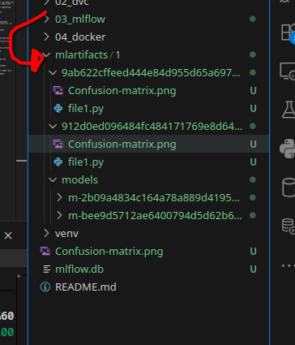
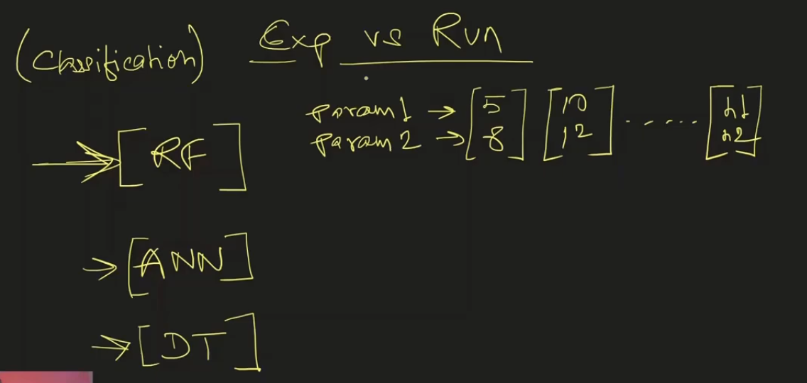

<br>
<br>


# `# MLFLOW`

<br>
<br>


## `#01:  MLFlow vs DVC`

<br>


**Primarly DVC is design for Data Versioning. When the DVC get popular then it copies some functionality from MLFlow for expriment Tracking. So, Mlflow is more mature than DVC. Previously,we use git parallely with dvc. But here, we don't need the both. Also, we can work with collaboration with out teamate with mlflow.**

<br>


## `#02: Installation`

```bash
pip install mlflow
```

<br>


## `#03: Running the interface`
```bash
mlflow ui 
```


<br>
<br>

# `#04: Which thing we can log with MlFlow`

<br>
<br>

MLflow is a powerful tool for tracking and managing machine learning experiments. Here’s a list of things that can be tracked/logged using MLflow, which you can include in your tutorial documentation:

### 1. **Metrics:**
   - **Accuracy**: Track model accuracy over different runs.
   - **Loss**: Log training and validation loss during the training process.
   - **Precision, Recall, F1-Score**: Log evaluation metrics for classification tasks.
   - **AUC (Area Under Curve)**: Track AUC for classification models.
   - **Custom Metrics**: Any numeric value can be logged as a custom metric (e.g., RMSE, MAE).

### 2. **Parameters:**
   - **Model Hyperparameters**: Log values such as learning rate, number of trees, max depth, etc.
   - **Data Processing Parameters**: Track parameters used in data preprocessing, such as the ratio of train-test split or feature selection criteria.
   - **Feature Engineering**: Log any parameters related to feature extraction or engineering.

### 3. **Artifacts:**
   - **Trained Models**: Save and version models for easy retrieval and comparison.
   - **Model Summaries**: Log model summaries or architecture details.
   - **Confusion Matrices**: Save visualizations of confusion matrices.
   - **ROC Curves**: Log Receiver Operating Characteristic curves.
   - **Plots**: Save any custom plots like loss curves, feature importances, etc.
   - **Input Data**: Log the datasets used in training and testing.
   - **Scripts & Notebooks**: Save code files or Jupyter notebooks used in the experiment.
   - **Environment Files**: Track environment files like `requirements.txt` or `conda.yaml` to ensure reproducibility.

### 4. **Models:**
   - **Pickled Models**: Log models in a serialized format that can be reloaded later.
   - **ONNX Models**: Log models in the ONNX format for cross-platform usage.
   - **Custom Models**: Log custom models using MLflow’s model interface.

### 5. **Tags:**
   - **Run Tags**: Tag your experiments with metadata like author name, experiment description, or model type.
   - **Environment Tags**: Tag with environment-specific details like `gpu` or `cloud_provider`.

### 6. **Source Code:**
   - **Scripts**: Track the script or notebook used in the experiment.
   - **Git Commit**: Log the Git commit hash to link the experiment with a specific version of the code.
   - **Dependencies**: Track the exact version of libraries and dependencies used.

### 7. **Logging Inputs and Outputs:**
   - **Training Data**: Log the training data used in the experiment.
   - **Test Data**: Log the test or validation datasets.
   - **Inference Outputs**: Track the predictions or outputs of the model on a test set.

### 8. **Custom Logging:**
   - **Custom Objects**: Log any Python object or file type as a custom artifact.
   - **Custom Functions**: Track custom functions or methods used within the experiment.

### 9. **Model Registry:**
   - **Model Versioning**: Track different versions of models and their lifecycle stages (e.g., `Staging`, `Production`).
   - **Model Deployment**: Manage and track the deployment status of different models.

### 10. **Run and Experiment Details:**
   - **Run ID**: Each run is assigned a unique identifier.
   - **Experiment Name**: Group multiple runs under a single experiment name.
   - **Timestamps**: Log start and end times of each run to track duration.


<br>
<br>

# `#05: How all the expriment is tracking?? And Delete An Expriment?`

<br>
<br>




<br>


**For deleting an expriment we need to find the run id from the above folder. If we delete the above folder then the run id will automatically deleted. And also delete from ui.**


<br>
<br>

# `#06:  Expriment VS Run`

<br>
<br>





**Here, Run means if we want to change the value of hyper-parameter then it's called RUN. But if we want to change the algorithrm then it's called expriment.**  


<br>


<br>
<br>

# `#06: How to enable Remote Tracking:`

<br>
<br>


