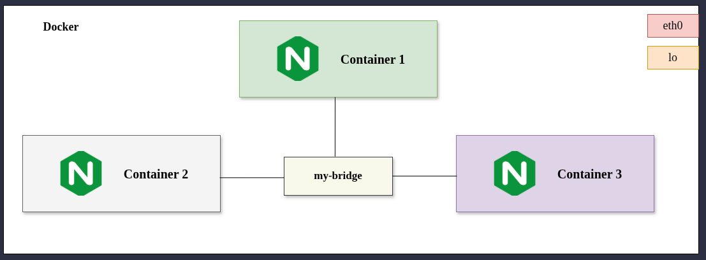

# `Docker Communication Between Container With Bridge Network`

**Objective:** This lab demonstrates the process of setting up a custom bridge network in Docker to allow communication between multiple containers. By default, Docker containers are isolated, but they can be connected through a user-defined network, which provides benefits like easier name resolution and improved security. In this lab, you'll create a custom bridge network, launch multiple Nginx containers on that network, and verify their ability to communicate using container names.

- Learn how to create and manage custom Docker networks.
- Launch multiple containers and connect them to a custom network.
- Verify container communication using the ping command.
- Troubleshoot and ensure proper communication between containers on the same network. 

## Communication Between Containers in a Custom Bridge Network

When working with Docker, containers by default are isolated. However, when containers need to communicate with each other, you can connect them to the same Docker network. A user-defined bridge network provides more control over how Docker containers communicate compared to the default bridge network. This guide will walk you through setting up a custom bridge network, launching multiple Nginx containers on that network, and verifying communication between them.




## Why Use a User-Defined Bridge Network?

By default, Docker containers can communicate over a built-in network called the "default bridge network." However, using a user-defined bridge network provides the following benefits:

- **Name resolution:** Containers connected to the same network can communicate by their container names, making it easier to manage multi-container setups.
- **Isolated environment:** Containers on a user-defined network are isolated from others unless explicitly connected to other networks.
- **Security:** You can control which containers can communicate by connecting them only to specific networks.

Now, let's move on to creating the network and launching our containers.

## Creating the User-Defined Bridge Network

The first step is to create a custom bridge network. Docker allows you to create networks of different types, such as bridge, overlay, and host. Here, we'll use the bridge driver, which is the default type for local container communication on a single host.
```bash
docker network create --driver bridge my-bridge-network
```
This command creates a bridge network named my-bridge-network. You can inspect the network details using the command below:
```bash
docker network inspect my-bridge-network
```
## Verifying Network Creation

You can list all existing Docker networks by running:
```bash
docker network ls
```
The newly created my-bridge-network should appear in the list, showing that it uses the bridge driver.


## Launching Containers and Connecting to the Network

In this section, we'll launch three containers (container1, container2, and container3), each running the Nginx web server, and connect them to our user-defined network.
```bash
# Container-1
docker run -d --name container1 --network=my-bridge-network nginx

# Container-2
docker run -d --name container2 --network=my-bridge-network nginx

# Container-3
docker run -d --name container3 --network=my-bridge-network nginx

```
With all three containers running, they are now connected to the same network, my-bridge-network. This enables them to communicate directly with one another.

## Verifying Container Status
To check the status of the running containers, use the command:
```bash
docker ps
```
Here, you'll see the list of running containers along with their names, statuses, and other details like port mappings. The containers container1, container2, and container3 should be listed as running, confirming that Nginx is operational inside each container.
 
## Verifying Communication Between Containers:
Now that the containers are up and running, let's check if they can communicate with each other using their container names.

### Accessing the Shell of Container 1:
First, we'll access the shell of container1 to ping the other containers. Run:
```bash
docker exec -it /bin/bash
```
This opens an interactive shell session inside container1. From this session, we can try pinging the other containers by their names.

### Pinging Container 2 from Container 1:
```bash
apt-get update
apt-get install -y iputils-ping
```
Now we can ping container2 from container1.
```bash
ping container2 -c 5
```
This command will send 5 ICMP echo requests to container2. A successful ping will indicate that container1 can communicate with container2.


### Pinging Container 3 from Container 1:
Next, try pinging container3 from container1:
```bash
ping container3 -c 5
```
Now do the same for all continer2 and container3. 

<br>
<br>

---
---
---
---

<br>
<br>


## Part 1: Explaining the Docker Network JSON

Here is what each key in your `docker network inspect` output means, along with a practical example or analogy for clarity.

```bash
docker network inspect my-bridge-network
```

| Key | Meaning | Example / Analogy |
| --- | --- | --- |
| **`Name`** | The user-defined name of the Docker network. | Like naming a Wi-Fi router `"Home_WiFi"`. Here it is `"my-bridge-network"`. |
| **`Id`** | A unique, long cryptographic hash identifier for this network. | Like a device's unique MAC address or a social security number. |
| **`Created`** | The exact timestamp when this network was created. | `2026-06-21T10:18:49...` (Created today). |
| **`Scope`** | Defines where the network exists. `"local"` means it only exists on this specific host machine. | A physical Ethernet switch inside your house; devices outside your house can't plug into it directly. |
| **`Driver`** | The network type provider. `"bridge"` creates a software-based bridge. | The type of technology used (e.g., standard Ethernet vs. Wi-Fi). |
| **`EnableIPv4` / `EnableIPv6**` | Flags showing whether IPv4 and IPv6 addressing are enabled. | Here, IPv4 is turned on (`true`), but IPv6 is turned off (`false`). |
| **`IPAM` (IP Address Management)** | Defines how IP addresses are handed out and managed on this network. | Acts like a DHCP server on a router, automatically giving an IP to any device that connects. |
| **`Subnet`** | The range of IP addresses available to containers on this network. | `172.18.0.0/16` means containers will get IPs starting with `172.18.x.x`. |
| **`Gateway`** | The exit/entry router IP for the network. Containers use this to talk to the outside world. | `172.18.0.1` is the main door. To reach Google, a container sends data through this IP. |
| **`Internal`** | If `true`, restricts containers from accessing the outside internet. | `"Internal": false` means your containers *can* talk to the internet. |
| **`Attachable`** | If `true`, manually started containers (`docker run`) can join it. | If `false` (like here), it's usually managed strictly by services like Docker Compose. |
| **`Containers`** | A list of containers currently plugged into this network. | Currently `{}` (empty), meaning no containers are running on it right now. |
| **`IPsInUse`** | Number of IP addresses currently reserved or active. | Says `3` IPs are in use (often includes the gateway and system daemons). |

---

## Part 2: What is the "Driver" here?

In the command:

`docker network create --driver bridge my-bridge-network`

The **`--driver`** flag tells Docker **how** to isolate and route the network traffic. Think of a driver as a software blueprint. By specifying `bridge`, you are telling Docker: *"Use the standard built-in bridge blueprint to create a virtual switch on this computer."* If you don't specify `--driver`, Docker defaults to `bridge` anyway.

---

## Part 3: Difference Between Bridge, Overlay, and Host Drivers

Here is how the three major Docker network drivers compare:

| Feature | Bridge Network | Overlay Network | Host Network |
| --- | --- | --- | --- |
| **Concept** | A private virtual network internal to a **single** host machine. | A network that spans **multiple** physical host machines. | Removes network isolation between the container and the host. |
| **Scope** | Local (Single machine) | Swarm / Global (Multi-machine cluster) | Local (Single machine) |
| **IP Address** | Container gets its own private IP (e.g., `172.18.0.2`). | Container gets a unique IP across the entire cluster. | Container shares the **exact same IP** as your main computer. |
| **Port Mapping** | Required (e.g., `-p 8080:80`). | Handled automatically across the cluster via ingress. | Not needed. If container uses port 80, it binds directly to host's port 80. |
| **Security/Isolation** | **High.** Containers are isolated from the host unless ports are explicitly opened. | **High.** Encrypted traffic between different servers. | **Low.** Container has full access to the host's network stack. |
| **Best Used For** | Standard applications running on a single computer or server. | Multi-container setups spread across multiple servers (Docker Swarm/Kubernetes). | Maximum performance applications where network speed is critical (eliminates routing overhead). |


