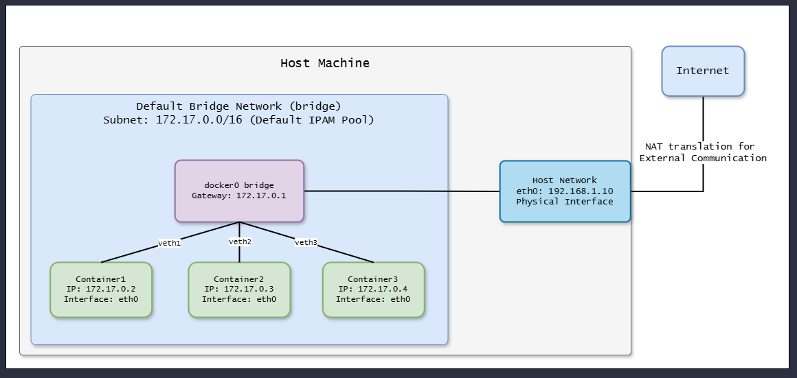
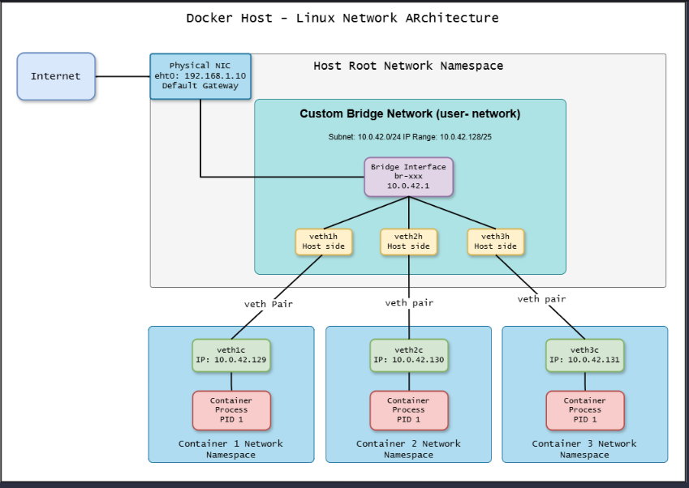
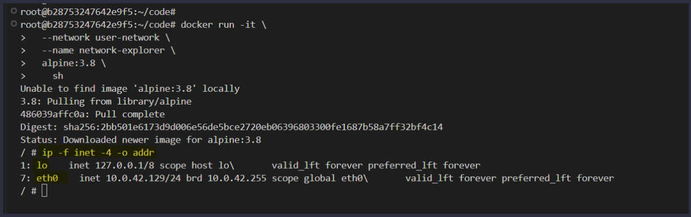
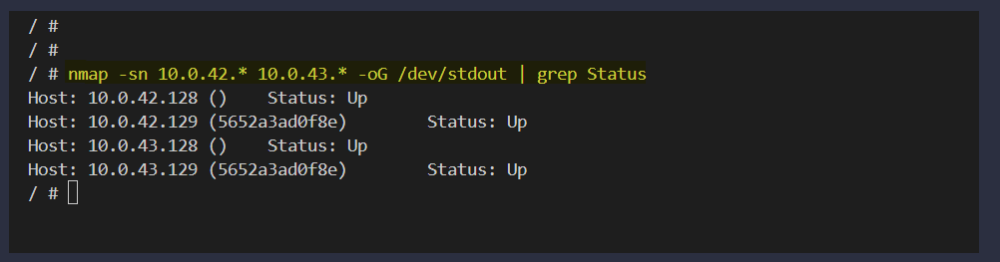

# `Understanding Bridge Networks in Docker: A Comprehensive Guide:`

**In the world of containerization, Docker stands out as a powerful tool for deploying and managing applications. One of its key features is the ability to manage networking between containers, and bridge networks play a central role in facilitating this communication. In this lab, we’ll dive deep into Docker’s bridge networks, exploring how to create custom networks, attach containers to multiple networks, and use diagnostic tools like ip and nmap to inspect network configurations and discover other containers. Whether you’re a beginner or an experienced Docker user, this guide will provide you with a clear and detailed understanding of bridge networks.**



## What Are Bridge Networks?
Before we jump into the technical details, let’s clarify what a bridge network is in Docker. By default, Docker uses a bridge network to enable communication between containers on the same host. A bridge network is essentially a virtual network that acts as a middleman, connecting containers to each other and, optionally, to the outside world via the host machine. It’s built on top of Linux’s bridge functionality, providing a layer of isolation while allowing controlled connectivity.




When you launch a container without specifying a network, Docker attaches it to the default bridge network (bridge). However, for more control over IP addressing, subnet configuration, and container communication, you can create custom bridge networks. These custom networks are the focus of this lab, as they offer greater flexibility and functionality.


## Creating and Inspecting a Custom Bridge Network:
Let’s begin by creating a custom bridge network and breaking down the process step by step. Open your terminal and execute the following command:

```bash
docker network create \
  --driver bridge \
  --label project=dockerinaction \
  --label br-net \
  --attachable \
  --scope local \
  --subnet 10.0.42.0/24 \
  --ip-range 10.0.42.128/25 \
  user-network
```

This command creates a custom bridge network named user-network. Let’s dissect its components to understand what’s happening:

- --driver bridge: Specifies that we’re using the bridge driver, which is the default networking mode for container communication on a single host.

- --label project=dockerinaction --label br-net: Adds metadata labels to the network. Labels are useful for organization and filtering, especially in large projects.

- --attachable: Makes the network attachable, meaning standalone containers (not just those managed by Docker Compose) can connect to it dynamically.

- --scope local: Limits the network’s scope to the local Docker host, ensuring it doesn’t span multiple hosts (unlike overlay networks).

- --subnet 10.0.42.0/24: Defines the subnet for the network, in this case, a range of 256 IP addresses (from 10.0.42.0 to 10.0.42.255).

- --ip-range 10.0.42.128/25: Restricts the assignable IP addresses to a subset of the subnet, specifically 10.0.42.128 to 10.0.42.255 (128 addresses).
user-network: The name of the network, which we’ll use to reference it later.

This configuration gives us a tailored network environment with precise control over IP allocation and container connectivity.

## Inspecting the Network:
Once the network is created, you can inspect its details using the docker network inspect user-network command. The output will include information about the subnet, IP range, gateway, and any containers currently attached. This step is crucial for verifying that the network matches your intended configuration.

Now, let’s launch a container and connect it to this network:
```bash
docker run -it \
  --network user-network \
  --name network-explorer \
  alpine:3.8 \
    sh
```
Here’s what this command does:
- docker run -it: Starts an interactive terminal session in the container.
- --network user-network: Attaches the container to our custom user-network.
- --name network-explorer: Names the container for easy reference.
- alpine:3.8 sh: Uses the lightweight Alpine Linux image (version 3.8) and starts a shell (sh).

Once inside the container, run the following command to examine its network interfaces:
```bash
ip -f inet -4 -o addr
```
This command lists the IPv4 addresses assigned to the container’s interfaces. You’ll see output resembling:



- lo: The loopback interface (127.0.0.1), present in all networked systems.
- eth0: The container’s Ethernet interface, assigned an IP like 10.0.42.129 from the user-network’s IP range.

This confirms that the container is successfully connected to user-network and has an IP within the specified range.

## Attaching Containers to Multiple Networks
One of Docker’s powerful features is the ability to connect a single container to multiple networks. Let’s create a second bridge network, user-network2, and attach our network-explorer container to it.


First, create the new network:
```bash
docker network create \
  --driver bridge \
  --label project=dockerinaction \
  --label br-net \
  --attachable \
  --scope local \
  --subnet 10.0.43.0/24 \
  --ip-range 10.0.43.128/25 \
  user-network2
```
This command mirrors the earlier one but uses a different subnet (10.0.43.0/24) and IP range (10.0.43.128/25). To see all available networks, run:
```bash
docker network ls
```
You’ll see both user-network and user-network2 listed, along with the default networks like bridge, host, and none.

Now, connect the network-explorer container to user-network2:
```bash
docker network connect \
  user-network2 \
  network-explorer
```
This dynamically attaches the running container to the second network. Inside the container, re-run the ip -f inet -4 -o addr command. You’ll now see an additional interface (e.g., eth1) with an IP from user-network2, such as 10.0.43.129. This demonstrates how a container can participate in multiple isolated networks simultaneously, enhancing its communication capabilities.

## Enhancing Exploration with nmap:

To dive deeper into network discovery, let’s install and use nmap (Network Mapper) inside the network-explorer container. First, install it:
```bash
docker exec -it network-explorer sh -c "apk update && apk add nmap"
```
- docker exec -it: Executes a command inside the running network-explorer container.
- apk update && apk add nmap: Updates the Alpine package index and installs nmap.

Why use nmap? It’s a versatile tool for network exploration, allowing us to scan for active devices, troubleshoot connectivity, and audit security within the containerized environment

## Scanning the Networks:
With nmap installed, scan the subnets of both networks:
```bash
nmap -sn 10.0.42.* 10.0.43.* -oG /dev/stdout | grep Status
```
Breaking this down:
- -sn: Performs a ping scan (no port scanning), checking for live hosts.
- 10.0.42.* 10.0.43.*: Targets the subnets of user-network and user-network2.
- -oG /dev/stdout: Outputs results in a greppable format to the terminal.
- grep Status: Filters the output to show only the status of discovered hosts.

The output might look like:


This reveals:
- The container’s IPs (10.0.42.129 and 10.0.43.129), confirming its presence on both networks.
- This scan provides a snapshot of active devices, helping you map out the network topology.


