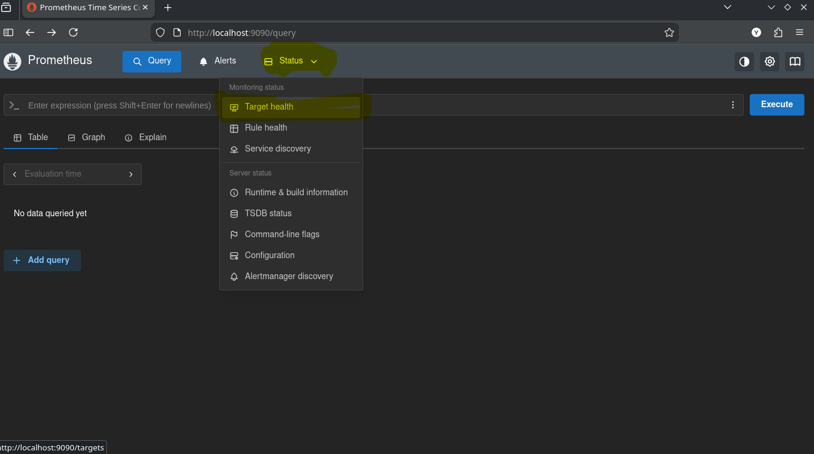
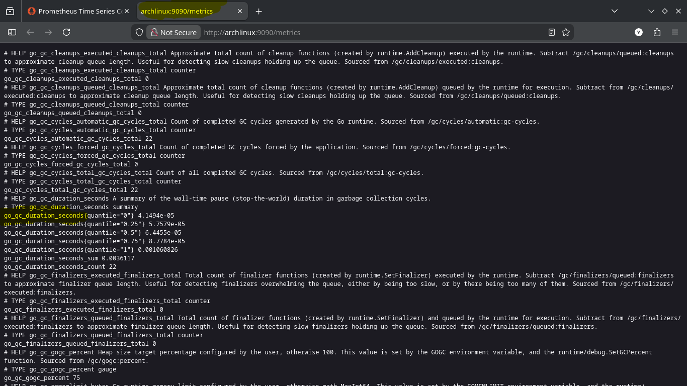
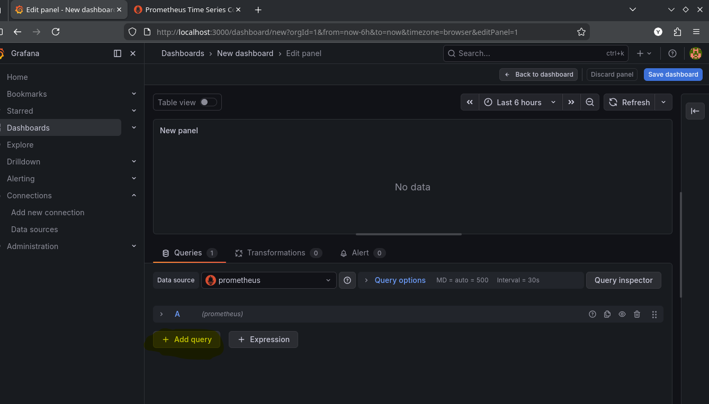
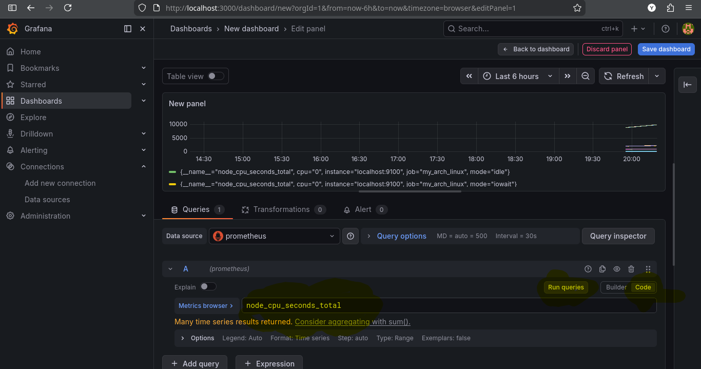
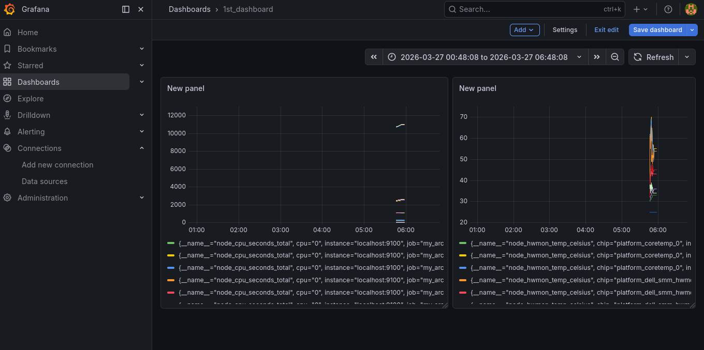

## Topics:
- #01: Need of monitoring-observability and alerting in microservices.
- #02: Monitoring vs Observability
- #03: Telemetry Data
- #04: Methods of Metrics Collection
- #05: Prometheus Data Model
- #06: PromQL Basics
- #07: Download Promethius in arch linux
- #08: Node Exporter on Linux and Track the host
- #09: Grafana Cloud, Setup And Alerting

**`With Prometheus we collect data from multiple sources and then with Grafana we plot graph based on those collected data.`**

# `**#01: Observability in Microservices**`
- **Why Observability Matters**:
  - Microservices are inherently distributed, making it difficult to track system behavior.
  - Observability provides insights into the state and health of the system through logs, metrics, and traces.
  - It helps in identifying bottlenecks, detecting failures, and ensuring reliability and performance.

### **Monitoring Basics**
- **Definition**: Monitoring is the process of collecting and visualizing data about a system’s health and performance over time.
- **Key Questions Monitoring Answers**:
  - Is the service running?
  - Is the service functioning as expected?
  - Is the service performing within acceptable thresholds?


# `**#02: Monitoring vs. Observability**`
| **Monitoring**                           | **Observability**                        |
|------------------------------------------|------------------------------------------|
| Tracks predefined metrics.               | Offers deeper insights into unknown issues. |
| Answers "What is wrong?"                 | Answers "Why is it wrong?"               |
| Focused on system health.                | Focused on understanding internal state. |

# `**#03: Telemetry Data**`

Telemetry data is the automated recording and real-time transmission of data from remote or distributed sources to a central system for monitoring, analysis, and optimization. It acts as the backbone of observability for software (logs, metrics, traces) and hardware (sensors), helping organizations monitor system health, performance, and user behavior.

- Telemetry data includes:
  - **Metrics**: Quantitative data, e.g., CPU usage, response time.
  - **Logs**: Detailed event records.
  - **Traces**: Sequence of events showing request flow.


# `**#04: Methods of Metrics Collection: Scraping (Pull), Exporters and Pushgateway**`

## 1. Scraping (Pull Model)

This is Prometheus's primary and default method for collecting metrics. Prometheus actively initiates HTTP requests (pulls) to endpoints that expose metrics.

### How it Works
1.  **Target Definition:** You define targets (servers, applications, services) in Prometheus's configuration file (`prometheus.yml`) or via service discovery (Kubernetes, Consul, AWS EC2, etc.).
2.  **Exposure:** The target application exposes an HTTP endpoint (usually `/metrics`) that returns metrics in a plain-text format (or Protocol Buffers).
3.  **Pull:** Prometheus periodically sends a `GET` request to that endpoint based on the `scrape_interval` (default: 1 minute).
4.  **Storage:** Prometheus ingests the samples and stores them in its local time-series database (TSDB).

### Configuration Example (`prometheus.yml`)
```yaml
scrape_configs:
  - job_name: 'my-app'
    scrape_interval: 15s  # Override global interval
    static_configs:
      - targets: ['localhost:8080', '10.0.0.5:8080']
        labels:
          environment: 'production'
          team: 'backend'
```

### Advantages
- **Built-in Service Discovery:** Automatically discovers new instances in dynamic environments (Kubernetes, cloud).
- **Health Monitoring:** If a target stops responding, Prometheus marks it as "down" and can alert immediately.
- **No Application Modification Required:** For off-the-shelf software (databases, web servers), you simply deploy an exporter.

### Disadvantages
- **Requires Reachability:** Prometheus must be able to reach the target's IP/port. This can be problematic behind strict firewalls, NAT, or in ephemeral job scenarios.


## 2. Exporters

Exporters are "bridges" that translate metrics from third-party systems into a format that Prometheus can scrape. They run as separate processes (or sidecar containers) alongside the application you want to monitor.

### Categories of Exporters

| Category | Examples | What They Do |
|----------|----------|--------------|
| **Infrastructure** | Node Exporter, Windows Exporter | Expose system metrics (CPU, memory, disk, network) from the host OS. |
| **Database** | PostgreSQL Exporter, MySQL Exporter, MongoDB Exporter | Query database internal statistics (connections, queries, replication lag). |
| **Hardware** | SNMP Exporter, IPMI Exporter | Collect metrics from network devices (routers, switches) or server BMCs via SNMP/IPMI. |
| **Third-Party SaaS** | CloudWatch Exporter, Stackdriver Exporter | Pull metrics from AWS/GCP APIs and expose them to Prometheus. |
| **Blackbox** | Blackbox Exporter | Probes endpoints (HTTP, ICMP, DNS, TCP) externally—simulates user monitoring. |

### How Exporters Work
1.  **Collect:** The exporter queries the target system's native API, reads log files, or runs SQL queries.
2.  **Translate:** It converts that data into Prometheus metrics (counters, gauges, histograms).
3.  **Expose:** It runs an HTTP server (often on a non-standard port like `9100` for Node Exporter) that serves `/metrics`.

### Example: Node Exporter
```yaml
# Run node exporter on a Linux server
$ ./node_exporter --web.listen-address=":9100"

# Prometheus scrapes it
scrape_configs:
  - job_name: 'node'
    static_configs:
      - targets: ['server1:9100', 'server2:9100']
```

### Best Practices
- Run exporters on the **same host** as the application when possible (or as a sidecar).
- Use **official exporters** from the Prometheus community for stability.
- For custom applications, you can either **embed a `/metrics` endpoint** in the app itself or build a **custom exporter**.


## 3. Pushgateway

The Pushgateway is used for **short-lived, batch, or ephemeral jobs** that cannot be scraped by Prometheus because they don't exist long enough to be discovered.

### When to Use Pushgateway
- **Cron jobs / scheduled batch processes:** A script that runs every hour, processes data, and exits.
- **CI/CD pipelines:** Jenkins, GitLab CI, GitHub Actions jobs that run temporarily.
- **Machine learning training jobs:** Ephemeral compute instances that terminate after finishing.
- **Lambda functions / serverless:** Functions that spin up and down without a persistent endpoint.

### How It Works
1.  **Push, Don't Pull:** Your job sends metrics to the Pushgateway via a `POST` or `PUT` HTTP request before terminating.
2.  **Storage in Pushgateway:** The Pushgateway stores these metrics in memory (temporarily).
3.  **Prometheus Scrapes Pushgateway:** Prometheus scrapes the Pushgateway's `/metrics` endpoint like any other target, retrieving the metrics from all jobs that pushed to it.
4.  **Metric Expiry:** Metrics remain in the Pushgateway until explicitly removed or overwritten.

### Example: Pushing Metrics from a Shell Script
```bash
# Push a single metric
echo "my_batch_job_duration_seconds 42.5" | \
curl --data-binary @- http://pushgateway:9091/metrics/job/my_cron_job

# Push with instance label
cat <<EOF | curl --data-binary @- http://pushgateway:9091/metrics/job/my_cron_job/instance/$(hostname)
# TYPE my_batch_records_processed counter
my_batch_records_processed_total 1000
EOF
```

### Configuration for Prometheus
```yaml
scrape_configs:
  - job_name: 'pushgateway'
    honor_labels: true  # Important: preserve labels set during push
    static_configs:
      - targets: ['pushgateway:9091']
```

### ⚠️ Critical Considerations
- **Not a Database:** The Pushgateway is not a long-term metrics store. It's an ephemeral buffer.
- **Single Point of Failure:** If the Pushgateway goes down, you lose metrics for all pushing jobs.
- **Stale Metrics:** You must explicitly manage metric expiry; otherwise, old metrics from failed jobs will persist indefinitely.
- **Not for Long-Lived Services:** For long-running services (web servers, databases), use direct scraping, not Pushgateway. Scraping is more reliable and scalable.

---

## Comparison Table

| Feature | Scraping (Pull) | Exporters | Pushgateway |
|---------|-----------------|-----------|-------------|
| **Direction** | Prometheus → Target | Target (exporter) → Prometheus (via pull) | Application → Pushgateway → Prometheus |
| **Use Case** | Long-lived services, infrastructure | Third-party systems without native Prometheus metrics | Short-lived batch jobs, ephemeral tasks |
| **Persistence** | Metrics stored in Prometheus TSDB | Metrics stored in Prometheus TSDB | Metrics stored temporarily in Pushgateway |
| **Target Reachability** | Prometheus must reach targets | Prometheus must reach exporters | Pushgateway must be reachable from jobs |
| **Service Discovery** | Native support (Kubernetes, EC2, etc.) | Same as scraping (exporter is the target) | Only one target (the Pushgateway itself) |
| **Complexity** | Low (configuration only) | Medium (deploy and configure exporter) | Medium (need to instrument jobs to push) |

---

## Typical Architecture

```
┌─────────────────────────────────────────────────────────────────┐
│                         Prometheus Server                        │
│                    (Pull Scrapes Every 15-30s)                  │
└─────────────────────────────────────────────────────────────────┘
         ▲                    ▲                    ▲
         │ HTTP GET /metrics  │ HTTP GET /metrics  │ HTTP GET /metrics
         │                    │                    │
┌────────┴────────┐  ┌────────┴────────┐  ┌────────┴────────┐
│  Application    │  │   Exporter      │  │  Pushgateway    │
│(Native /metrics)│  │                 │  │                 │
└─────────────────┘  └─────────────────┘  └─────────────────┘
         ▲                    ▲                    ▲
         │                    │                    │ HTTP POST /metrics
         │                    │                    │ (push on job completion)
         │                    │                    │
┌────────┴────────┐  ┌────────┴────────┐  ┌────────┴────────┐
│  App Code       │  │ Third-Party     │  │ Batch Job       │
│  (already       │  │ System          │  │ Cron Job        │
│   instrumented) │  │ (MySQL, Nginx,  │  │ CI Pipeline     │
│                 │  │  SNMP device)   │  │ Lambda Function │
└─────────────────┘  └─────────────────┘  └─────────────────┘
```

---

## Summary: Which One Should You Use?

- **Use Pull + Native Instrumentation** if you control the application code and it runs continuously (e.g., a web service, API).
- **Use Exporters** for off-the-shelf software (databases, message queues, operating systems, hardware) that doesn't expose Prometheus metrics natively.
- **Use Pushgateway** only for ephemeral jobs that start, do work, and exit. For everything else, prefer the pull model for better reliability and scalability.

The pull model is the foundation of Prometheus's architecture—it gives you built-in health checks, automatic discovery, and a single source of truth for configuration. Exporters extend that model to cover virtually any system, while the Pushgateway fills the gap for workloads that don't fit the pull paradigm.


# `**#05: Prometheus Data Model**`
- Prometheus stores **time series data**.
- Each time series is identified by:
  - **Metric name**: Represents what is being measured (e.g., `http_requests_total`).
  - **Labels**: Key-value pairs for filtering and grouping (e.g., `status="200"`).
  - Example: `predict_api_hit{count="1", time_taken="600"}`.


# `**#06: PromQL Basics**`
- PromQL is the query language for Prometheus. By using this language we can query in our prometheus like with sql we query of database.
- **Examples**:
  - `up`: Shows whether targets are up (1) or down (0).
  - `rate(http_requests_total[5m])`: Computes request rate over the last 5 minutes.
  - `sum by (status)(http_requests_total)`: Groups and sums requests by HTTP status.


# `#07: Download Prometheus in arch linux:`

```bash
sudo pacman -S prometheus

# Start the Prometheus service now
sudo systemctl start prometheus

# Check the status to ensure it's running correctly
# prometheus will run on -> localhost:9090
sudo systemctl status prometheus
```
### 1. if we click Status -> Target-health, we will see that prometheus track it self.


**Browse that enpoint where prometheus track it self. But we will not understand this data. If we are beginner.**



**If we copy the highlighted part and search query we will find the data related that query and if we click in graph then it will show the graph related that data. By using the below command we can search a specific thing in prometheus.**

```bash
go_gc_heap_allocs_by_size_bytes_bucket{le="144.99999999999997"}
```

**I want to see the data of last 2min then the command will be**
```bash
go_gc_heap_allocs_by_size_bytes_bucket{le="144.99999999999997"}[2m]
```

**I want to do arithematic operation with my result then i can also do this.**
```bash
go_gc_heap_allocs_by_size_bytes_bucket{le="144.99999999999997"}/2
```
**We can also serch for promql fucntions and read the documentation: [link](https://prometheus.io/docs/prometheus/latest/querying/functions/)**


# `**#08: Node Exporter on Linux and Track the host**`
Here's how to set up the **Node Exporter** on Arch Linux and connect it to **Prometheus**.

## Step 1: Install Node Exporter on Arch Linux

The Node Exporter is available in the official Arch Linux repositories.

```bash
sudo pacman -S prometheus-node-exporter
```


## Step 2: Start and Enable Node Exporter Service

```bash
# Start the service immediately
sudo systemctl start prometheus-node-exporter

# Enable it to start automatically on boot
sudo systemctl enable prometheus-node-exporter

# Check if it's running properly
sudo systemctl status prometheus-node-exporter
```
You should see `active (running)` in the output.


## Step 3: Verify Node Exporter is Working

The Node Exporter exposes metrics on port `9100`. You can test it with:

```bash
curl http://localhost:9100/metrics | head -n 20
```
You should see a lot of metrics starting with `node_` like `node_cpu_seconds_total`, `node_memory_MemTotal_bytes`, etc.

## Step 4: Configure Prometheus to Scrape Node Exporter

Now you need to tell Prometheus where to find the Node Exporter metrics.

1. **Edit Prometheus's configuration file:**
   ```bash
   sudo nano /etc/prometheus/prometheus.yml
   ```

2. **Add a new job for the Node Exporter** under `scrape_configs`. The file should look something like this:

```yaml
global:
  scrape_interval: 15s
  evaluation_interval: 15s

scrape_configs:
  # This is the default job for Prometheus itself
  - job_name: 'prometheus'
    static_configs:
      - targets: ['localhost:9090']

  # This is the new job for Node Exporter
  - job_name: 'node_exporter'
    static_configs:
      - targets: ['localhost:9100']
```

3. **Save the file** (in nano: `Ctrl+O`, then `Enter`, then `Ctrl+X` to exit).


## Step 5: Restart Prometheus to Apply Changes

After editing the configuration, restart Prometheus:

```bash
sudo systemctl restart prometheus
```

## Step 6: Verify Prometheus is Scraping Node Exporter

1. Open your browser and go to `http://localhost:9090`

2. Go to **Status → Targets** (or directly `http://localhost:9090/targets`)

3. You should see two targets:
   - **`prometheus`** (state: UP)
   - **`node_exporter`** (state: UP)

If `node_exporter` shows **DOWN**, check:
- Is the Node Exporter service running? (`sudo systemctl status prometheus-node-exporter`)
- Is there a firewall blocking port 9100?
- Did you correctly write `localhost:9100` in the config?

## Step 7: Query Metrics in Prometheus

Now that everything is connected, you can query Node Exporter metrics directly in Prometheus:

1. Go to the **Graph** tab at `http://localhost:9090/graph`

2. Try some example queries:
   - `node_memory_MemTotal_bytes` - Total RAM in bytes
   - `node_cpu_seconds_total{mode="user"}` - CPU time spent in user mode
   - `node_load1` - 1-minute load average
   - `node_filesystem_avail_bytes{mountpoint="/"}` - Available disk space on root

3. Click **Execute** and then switch to the **Graph** tab to see the time series visualized.


## Important Files and Directories

| Path | Purpose |
|------|---------|
| `/etc/prometheus/prometheus.yml` | Main Prometheus configuration file |
| `/etc/systemd/system/prometheus-node-exporter.service` | Node Exporter service file |
| `/var/lib/prometheus/` | Prometheus time-series database (data storage) |

##  Troubleshooting

### Node Exporter not showing as UP in Prometheus targets

Check if the Node Exporter is actually listening:
```bash
ss -tuln | grep 9100
```
Should show `LISTEN` on port `9100`.

### Check Node Exporter logs
```bash
sudo journalctl -u prometheus-node-exporter -f
```

### Check Prometheus logs
```bash
sudo journalctl -u prometheus -f
```

## We can also do for:
Once Prometheus is successfully scraping Node Exporter metrics, you can:

1. **Add Grafana** to create beautiful dashboards
2. **Add Alertmanager** to set up alerts (e.g., disk space > 90%)
3. **Monitor more services** by adding exporters for:
   - PostgreSQL (`prometheus-postgres-exporter`)
   - MySQL (`prometheus-mysqld-exporter`)
   - Nginx (`prometheus-nginx-exporter`)
   - Redis (`prometheus-redis-exporter`)

<br>
<br>

## Some Important talk about Prometheus Learning:
`Prometheus it's self a huge topics. Should we learn the prometheus like we do for SQl. No, When we are working with a project that which log we need to monitor, we will only learn that time with related those topics.`

<br>
<br>

# `**#09: Grafana Cloud, Setup And Alerting**`
- Installation of grafana
```bash
sudo pacman -S grafana 
sudo systemctl start grafana

# grafanfa start at port no: 3000
# admin, admin
sudo systemctl status grafana
```
**Connection -> DataSources -> (add prometheus to grafana)**
**Dashboard -> New -> New Dashboard -> Add Visulization -> Prometheus**



**We can add multiple query. As we are working with Prometheus, we will give the promql query(clicking on code). And see the grpah. By adding multiple query we can add multiple graph.**



**Now, we can save dashboad, then go to home then again go to dashboard we will see the dashboard only. Similarly, we can add multiple dashboard.**



**We can do alerting with grafana. Also send the alert messages in mail or my community group.**


- **Advantages**:
  - No need for setup or maintenance.
  - Automatically updated with the latest features.
  - Handles complex architectures out-of-the-box.
- **Disadvantages**:
  - Higher costs for scaling.
  - Dependency on the vendor.
  - Reduced control over security and data management.

### **On-Premise Grafana Setup**
- **Advantages**:
  - Complete control over data and security.
  - Tailored to specific organizational needs.
  - No recurring license costs for basic features.
- **Disadvantages**:
  - Requires infrastructure and maintenance.
  - Scalability can be challenging.
  - Manual updates and configurations.


### **Alerting in Grafana**
1. **How Alerts Work**:
   - Alerts are raised when specific conditions (rules) are met.
   - Rules are defined using queries (e.g., CPU usage > 80%).

2. **Components**:
   - **Alert Manager**: Evaluates rules and triggers alerts.
   - **Notification Policies**: Define how alerts are routed.
   - **Contact Points**: Email, Slack, PagerDuty, or other mediums for notifications.

3. **Setup Example**:
   - Define a query: `avg_over_time(cpu_usage[5m]) > 80`.
   - Configure a notification policy to send alerts to an email address.

Changes to be made on default.ini file to add your email into Grafana alert notification system:

```yml
[smtp]
enabled = true
host = smtp.gmail.com:587
user = your-email@gmail.com
password = your-generated-app-password
from_address = your-email@gmail.com
from_name = Grafana Alerts
skip_verify = true
```


